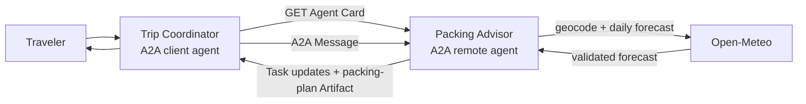

# A2A: Too Afraid to Ask

## Weather-aware travel-agent learning project

This project is a deliberately small, complete example of the Agent2Agent (A2A) Protocol. It
includes:

- a remote **Packing Advisor** agent that publishes an Agent Card and accepts A2A messages;
- a local **Trip Coordinator** command-line client that discovers and delegates to that agent;
- a task lifecycle with status updates, a structured packing-plan Artifact, and
  `INPUT_REQUIRED` continuation; and
- both deterministic, key-free planning and an optional OpenAI Responses API planner.

Forecast data comes from [Open-Meteo](https://open-meteo.com/) and is intended for this
non-commercial learning sample. The normal planner is ordinary deterministic Python and needs no
API key.

> **New to A2A?** Follow the illustrated, step-by-step tutorial:
> [Build Your First Weather-Aware A2A Agent in Python](docs/build-your-first-weather-aware-a2a-agent.md).

The standalone [Medium-ready draft](docs/medium-draft.md) retells the same project as a
publication-length, judgement-free narrative with FAQ, caption notes, and suggested tags.

## The mental model

A2A lets one agent delegate a goal to another agent without exposing how the remote agent reasons,
which tools it uses, or how it is implemented:

1. The Trip Coordinator fetches `/.well-known/agent-card.json` and checks the advertised A2A
   version, JSON-RPC interface, streaming capability, media types, and skill description.
2. It sends a user `Message` containing a structured packing request.
3. The Packing Advisor creates a server-owned `Task`, reports its state, gets an Open-Meteo
   forecast, and plans what to pack.
4. It returns one `packing-plan` `Artifact` with an `application/json` part for software followed
   by a `text/markdown` part for people.
5. If a required detail is missing, the Task enters `INPUT_REQUIRED`; the client sends another
   Message using the same task and context identifiers.



The example uses **A2A Protocol 1.0** over the **JSON-RPC 2.0** binding. Those are two different
versions: `1.0` identifies A2A semantics, while `2.0` identifies the JSON-RPC envelope format.

## A2A and MCP solve different boundaries

| Question | MCP | A2A |
|---|---|---|
| What is on the other side? | A tool or resource. | An independent, opaque agent. |
| Typical request | Invoke a named operation with arguments. | Send a Message that expresses a goal. |
| Discovery unit | Tools, resources, and prompts. | An Agent Card describing interfaces, capabilities, and skills. |
| Stateful work | Usually application-defined. | Tasks, contexts, lifecycle states, and Artifacts are protocol concepts. |
| In this repository | Ask a weather tool for data. | Delegate packing advice to another agent. |

The protocols complement each other. A production Packing Advisor could use MCP internally to call
weather, booking, or inventory tools while presenting one A2A boundary to its peers.

## Requirements and installation

- Python 3.11 or newer
- Internet access for live Open-Meteo calls
- Node.js/npm and [`uv`](https://docs.astral.sh/uv/), or Docker, only if you want to run A2A
  Inspector
- An OpenAI API key only for the optional OpenAI planner

From the series repository root, enter this topic before installing or running commands:

```bash
cd topics/a2a
python3 -m venv .venv
source .venv/bin/activate
python -m pip install --upgrade pip
python -m pip install -e ".[dev]"
```

Windows PowerShell users can activate the environment with:

```powershell
.venv\Scripts\Activate.ps1
```

To include the optional OpenAI planner, install both extras:

```bash
python -m pip install -e ".[ai,dev]"
```

The project reads standard environment variables. [`.env.example`](.env.example) documents them,
but the application does not silently load `.env` files.

## Run the Packing Advisor

Start the A2A server in terminal 1:

```bash
travel-a2a-server
```

It binds to `127.0.0.1:9999` by default, publishes its Agent Card at
`http://127.0.0.1:9999/.well-known/agent-card.json`, and advertises a JSON-RPC interface at the
server URL. The loopback binding is intentional: this sample does not add authentication, TLS,
rate limiting, or durable task storage.

## Discover and delegate

In terminal 2, activate the same environment and inspect the Agent Card:

```bash
travel-a2a card
```

Request a readable packing plan:

```bash
travel-a2a plan "Berlin, Germany" --days 3
travel-a2a plan "Boston, MA" --days 2 --style business --units imperial
```

See task events as they arrive:

```bash
travel-a2a plan "Reykjavík, Iceland" --days 4 --style outdoors --stream
```

Print the validated JSON part of the returned Artifact:

```bash
travel-a2a plan "São Paulo, Brazil" --days 3 --json
```

Omit `--days` in an interactive terminal to see multi-turn continuation:

```bash
travel-a2a plan "Tokyo, Japan"
```

The remote Task enters `INPUT_REQUIRED`; after you answer the prompt, the client continues the same
Task with its server-issued task and context IDs.

For all client commands, the agent URL is selected in this order:

1. `--agent-url`
2. `A2A_AGENT_URL`
3. `http://127.0.0.1:9999`

The server uses `A2A_PUBLIC_URL` when building the interface URL in its Agent Card. If you change
the listening port or place the server behind a proxy, keep the advertised public URL consistent
with the URL clients use.

## Application contract

The input data is:

```text
PackingRequest(
  destination: string[2..100],
  days: integer[1..7] | omitted,
  units: "metric" | "imperial" = "metric",
  style: "general" | "business" | "outdoors" = "general"
)
```

The completed `PackingPlan` contains the normalized location, forecast period, one daily summary
per requested day, essentials, weather-specific items, style-specific items, cautions, and
Open-Meteo attribution. The Artifact keeps the same information in two forms:

1. `application/json` — structured data validated by the client.
2. `text/markdown` — a readable rendering that must exactly match the client's rendering of the
   validated plan before display.

The Agent Card advertises one skill, `plan_weather_aware_packing`. A skill is descriptive discovery
metadata—it helps a client decide whether to delegate to the agent. It is **not** a remote method
that the client invokes by skill ID. The client sends an A2A Message to the advertised interface;
the remote agent decides how to handle it.

## Task outcomes

| Situation | Lifecycle |
|---|---|
| Valid complete request | `SUBMITTED → WORKING → Artifact → COMPLETED` |
| Missing trip length | `SUBMITTED → INPUT_REQUIRED`, then `WORKING → Artifact → COMPLETED` on the same Task |
| Unknown location | `SUBMITTED → WORKING → INPUT_REQUIRED`, then resume with a more specific destination |
| Invalid or unsupported input | `REJECTED` |
| Weather-provider or planner failure | `FAILED` with a sanitized diagnostic |

Streaming changes how quickly the client receives those events, not what the task means. The sample
does not insert fake delays for demonstration.

## Optional OpenAI planner

The deterministic planner is the default and keeps the core example reproducible. To use the
optional planner, install the `ai` extra, export a key, and select it when starting the server:

```bash
export OPENAI_API_KEY="your-key"
export OPENAI_MODEL="gpt-5.6"
travel-a2a-server --planner openai
```

You can also set `PACKING_PLANNER=openai`. The OpenAI Responses API produces validated packing
advice behind the same planner interface. Location, dates, temperatures, conditions, and
Open-Meteo attribution remain trusted application-owned fields; model output does not overwrite
them.

## Tests and quality checks

The normal suite is deterministic and makes no Open-Meteo or paid OpenAI request:

```bash
pytest
ruff check .
ruff format --check .
```

The live provider smoke test is separate and checks stable types rather than changing forecast
values:

```bash
RUN_LIVE_TESTS=1 pytest -m live -q
```

## Project layout

Here, `.` means the A2A topic root: `topics/a2a` in this repository.

```text
.
├── .env.example
├── pyproject.toml
├── README.md
├── docs/
│   ├── build-your-first-weather-aware-a2a-agent.md
│   ├── medium-draft.md
│   └── images/a2a-tutorial/
├── src/travel_a2a/
│   ├── cli.py               # travel-a2a command and interactive continuation
│   ├── coordinator.py       # defensive A2A client and event aggregation
│   ├── executor.py          # Message-to-Task lifecycle translation
│   ├── models.py            # strict request, forecast, advice, and plan contracts
│   ├── planner.py           # deterministic and optional OpenAI planners
│   ├── protocol.py          # shared A2A names, media types, and version constants
│   ├── server.py            # Agent Card, JSON-RPC routes, and server command
│   └── weather_service.py   # injectable Open-Meteo adapter
└── tests/
    ├── test_cli.py
    ├── test_coordinator.py
    ├── test_live_weather.py
    ├── test_models.py
    ├── test_planner.py
    ├── test_server.py
    └── test_weather_service.py
```

## Troubleshooting

`Connection refused`
: Start `travel-a2a-server`, then confirm the client and Agent Card use the same host and port.

`Agent Card validation failed`
: Treat cards as untrusted network data. Confirm the server publishes A2A 1.0, a JSON-RPC
  interface, supported JSON/Markdown media types, and an interface URL on the expected origin.

`Destination was not found`
: Add a state, region, or country, such as `Springfield, Illinois` or `Paris, France`.

`Weather provider is temporarily unavailable`
: Open-Meteo timed out, returned an error, or returned data that did not satisfy the adapter's
  schema. Retry later; raw provider details are intentionally not exposed to the peer agent.

`OpenAI planner is unavailable`
: Install `.[ai]`, export `OPENAI_API_KEY` in the server's shell, and use a model available to your
  account. Direct client commands still need no key.

## Production boundary

This is a local teaching project, not a deployment template. Before exposing an A2A agent, add
HTTPS, authentication and per-action authorization, durable task storage, resource limits, rate
limits, audit-safe observability, privacy controls, Agent Card trust policy, outbound URL controls,
and a deliberate secret-management strategy. Treat peer Messages, Agent Cards, Artifacts, status
text, file references, model output, and provider responses as untrusted input. Reject terminal
control characters and sanitize content again for the final HTML, terminal, or UI context.

## Data source

Weather and geocoding data: [Open-Meteo.com](https://open-meteo.com/). See its
[forecast documentation](https://open-meteo.com/en/docs),
[geocoding documentation](https://open-meteo.com/en/docs/geocoding-api), and
[usage terms](https://open-meteo.com/en/terms).
