# Build Your First Weather-Aware A2A Agent in Python

## A Trip Coordinator, a remote Packing Advisor, and the task lifecycle between them

Agent2Agent, usually shortened to **A2A**, gives independent agents a standard way to discover
each other, exchange messages, track work, ask for clarification, stream progress, and deliver
artifacts. In this tutorial, you will build a complete but deliberately small A2A project:

- a remote **Packing Advisor** agent;
- a local **Trip Coordinator** client agent;
- an Agent Card advertising one weather-aware packing skill;
- a stateful Task that can complete, reject a request, fail safely, or pause for more input;
- a structured packing-plan Artifact backed by live Open-Meteo forecasts;
- both request/response and Server-Sent Events streaming paths; and
- an optional OpenAI planner behind the same interface as the deterministic default.

Follow along with these finished project files:

- [`pyproject.toml`](../pyproject.toml)
- [`src/travel_a2a/models.py`](../src/travel_a2a/models.py)
- [`src/travel_a2a/weather_service.py`](../src/travel_a2a/weather_service.py)
- [`src/travel_a2a/planner.py`](../src/travel_a2a/planner.py)
- [`src/travel_a2a/executor.py`](../src/travel_a2a/executor.py)
- [`src/travel_a2a/server.py`](../src/travel_a2a/server.py)
- [`src/travel_a2a/coordinator.py`](../src/travel_a2a/coordinator.py)
- [`src/travel_a2a/cli.py`](../src/travel_a2a/cli.py)
- [`tests/`](../tests/)

By the end, you will understand Agent Cards, Messages, Parts, Tasks, contexts, lifecycle states,
Artifacts, streaming, and multi-turn continuation—and why an A2A skill is not a method name.

> **Version note:** This project pins `a2a-sdk[http-server]==1.1.2` and targets **A2A Protocol
> 1.0** through the **JSON-RPC 2.0** protocol binding. A2A `1.0` and JSON-RPC `2.0` describe
> different layers. Older A2A tutorials commonly target protocol `0.2` or `0.3` and use removed
> application wrappers, lower-case method names, or older Part shapes. The code here follows the
> 1.0 SDK APIs used by this repository.

---

## 1. See the destination

After installation, start the remote agent in terminal 1:

```bash
travel-a2a-server
```

It binds to `http://127.0.0.1:9999`, publishes an Agent Card at
`/.well-known/agent-card.json`, and receives JSON-RPC requests at `/`.

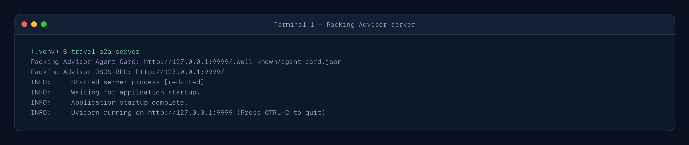

*The local Packing Advisor publishes discovery and JSON-RPC endpoints on loopback port 9999.
Captured from a verified run on 2026-09-04; the process ID is redacted.*

```text
(.venv) $ travel-a2a-server
Packing Advisor Agent Card: http://127.0.0.1:9999/.well-known/agent-card.json
Packing Advisor JSON-RPC: http://127.0.0.1:9999/
INFO:     Started server process [redacted]
INFO:     Waiting for application startup.
INFO:     Application startup complete.
INFO:     Uvicorn running on http://127.0.0.1:9999 (Press CTRL+C to quit)
```

In terminal 2, ask the agent what it claims to support:

```bash
travel-a2a card
```

Then delegate a complete packing request:

```bash
travel-a2a plan "Berlin, Germany" --days 3
```

No API key or LLM is required. The default packing planner is deterministic Python. A2A defines
how the two agent-facing programs communicate; it does not require either agent to use a language
model internally.

Now deliberately leave out one detail:

```bash
travel-a2a plan "Tokyo, Japan"
```

The remote task pauses in `INPUT_REQUIRED`. The coordinator asks `Days (1-7)`, then sends the
answer with the same server-issued task and context IDs. That continuation—not text generation—is
the first behavior that makes this example feel meaningfully different from a one-shot function
call.

### Checkpoint

Keep the three components separate:

```text
Trip Coordinator        Packing Advisor             Open-Meteo
(A2A client agent)  -->  (A2A remote agent)  -->    (weather provider)
                     A2A                       HTTPS
```

The provider does not speak A2A. The coordinator does not know the advisor's internal tools. The
advisor owns the task and decides how to produce the requested result.

---

## 2. The A2A mental model

Imagine planning a trip with a travel coordinator. You ask the coordinator for help. The
coordinator discovers a specialist packing advisor and reads the advisor's business card. That
card says what kinds of work the specialist accepts and how to contact it. The coordinator then
delegates the **goal**—“make a three-day packing plan for Berlin”—without telling the specialist
which weather service, rules, tools, or model to use.

The specialist opens a work order, reports progress, and either:

- completes it with a packing-plan deliverable;
- pauses to ask a question;
- rejects a request outside its contract; or
- marks the work failed without leaking private diagnostics.

That is the shape A2A standardizes.

### Tiny glossary

| Term | Plain-English meaning |
|---|---|
| Client agent | The program delegating work on behalf of a person or system; here, the Trip Coordinator. |
| Remote agent | The independent agent receiving the delegation; here, the Packing Advisor. |
| Agent Card | A JSON “business card” describing identity, interfaces, capabilities, security, and skills. |
| Skill | Descriptive discovery metadata explaining a kind of work the agent can handle. |
| Message | One turn from a user/client or agent, made of one or more Parts. |
| Part | A typed content container: text, structured data, raw bytes, or a URL reference. |
| Task | A server-owned, stateful unit of work with an ID and lifecycle. |
| Context | A server-issued ID grouping related interactions and possibly multiple Tasks. |
| Status | The Task's current state, optionally accompanied by an agent Message. |
| Artifact | A concrete Task output made of one or more Parts. |
| JSON-RPC | The request envelope used by this A2A interface. |
| SSE | Server-Sent Events, the ordered HTTP stream used for live updates. |

### The complete architecture

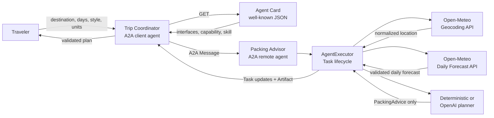

The planner owns recommendations. It does **not** own forecast facts. Location, dates,
temperatures, conditions, units, and source attribution come from the validated provider adapter
and are assembled into the final plan by application code.

### The complete task sequence

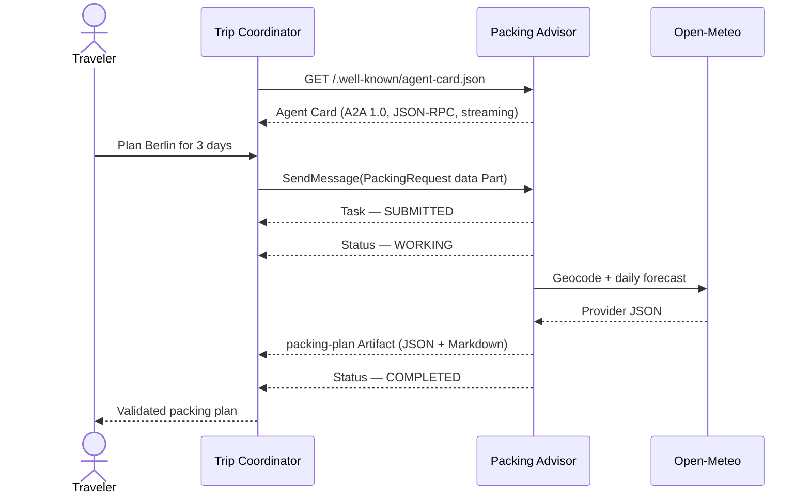

For a missing trip length, the sequence branches:

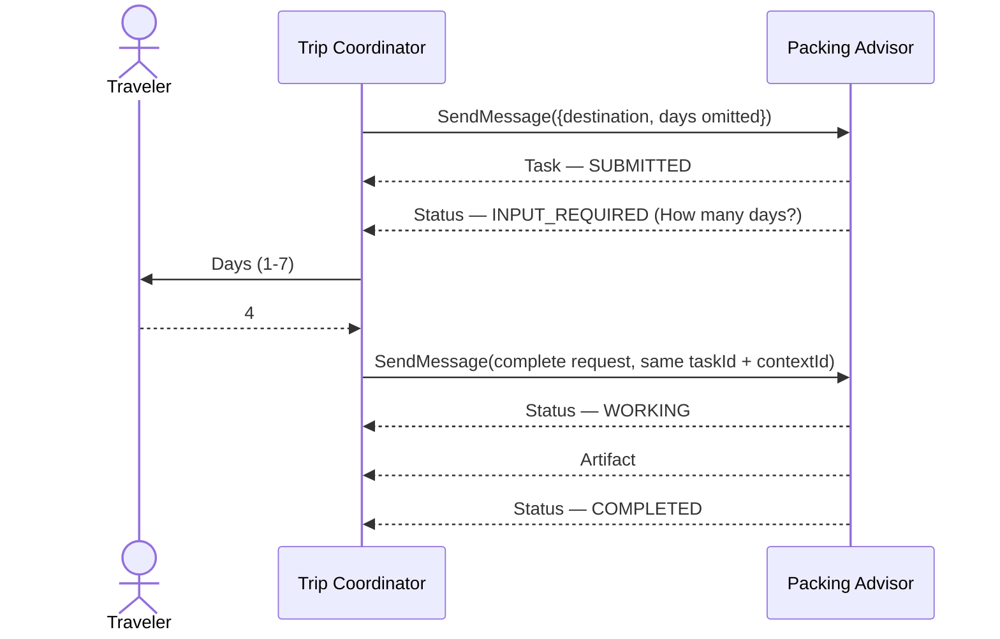

### A2A is not MCP with a different name

The official A2A documentation describes A2A and Model Context Protocol (MCP) as complementary
boundaries:

| Concern | MCP | A2A |
|---|---|---|
| Other side | A tool/resource server | An independent, opaque agent |
| Intent | Call a discrete capability | Delegate a goal and collaborate |
| Discovery | Tool/resource/prompt descriptions and schemas | Agent Card with interfaces, capabilities, security, and skills |
| Invocation | Named operation such as `tools/call` | A Message sent to an agent interface |
| Result | Tool content or structured content | Message or stateful Task with Artifacts |
| Multi-turn state | Usually defined by the host/application | Context and Task lifecycle are protocol concepts |

A Packing Advisor could use an MCP weather tool internally. Its A2A peers would still see an
opaque agent that accepts goals and returns work products—not its private toolbox.

---

## 3. Requirements and project setup

You need:

- Python 3.11 or newer;
- internet access for live Open-Meteo calls;
- optionally Node.js/npm and [`uv`](https://docs.astral.sh/uv/), or Docker, for A2A Inspector; and
- optionally an OpenAI API key for the model-backed planner.

Choose one starting point.

**Using this series checkout:**

```bash
cd topics/a2a
```

**Recreating the project independently:**

```bash
mkdir travel-a2a-learning
cd travel-a2a-learning
mkdir -p src/travel_a2a tests docs/images/a2a-tutorial
touch pyproject.toml README.md .env.example .gitignore
touch src/travel_a2a/{__init__,models,weather_service,planner,executor,server,coordinator,cli}.py
touch tests/{conftest,test_models,test_weather_service,test_planner,test_server,test_coordinator,test_cli,test_live_weather}.py
```

The [`tests/` directory](../tests/) is canonical. Both paths leave you at the A2A topic root.

Create and activate a virtual environment:

```bash
python3 -m venv .venv
source .venv/bin/activate
python -m pip install --upgrade pip
python -m pip install -e ".[dev]"
```

On Windows PowerShell:

```powershell
.venv\Scripts\Activate.ps1
```

The optional OpenAI implementation is kept out of the default install:

```bash
python -m pip install -e ".[ai,dev]"
```

### Package configuration

The central parts of [`pyproject.toml`](../pyproject.toml) are:

```toml
[build-system]
requires = ["hatchling==1.32.0"]
build-backend = "hatchling.build"

[project]
name = "travel-a2a-learning"
version = "0.1.0"
requires-python = ">=3.11"
dependencies = [
  "a2a-sdk[http-server]==1.1.2",
  "httpx==0.28.1",
  "pydantic==2.13.5",
  "uvicorn==0.52.4",
]

[project.optional-dependencies]
ai = ["openai==3.8.0"]
dev = [
  "pytest==9.1.1",
  "pytest-asyncio==1.4.0",
  "ruff==0.16.6",
]

[project.scripts]
travel-a2a = "travel_a2a.cli:main"
travel-a2a-server = "travel_a2a.server:main"

[tool.hatch.build.targets.wheel]
packages = ["src/travel_a2a"]
```

| Package | Job |
|---|---|
| `a2a-sdk[http-server]` | Implements A2A types, client/server machinery, JSON-RPC routes, and HTTP support. |
| `httpx` | Fetches Agent Cards and Open-Meteo data asynchronously. |
| `pydantic` | Defines strict application and provider contracts. |
| `uvicorn` | Runs the Starlette application locally. |
| `openai` | Supports only the optional Responses API planner. |

### Environment variables

The project documents settings in [`.env.example`](../.env.example):

```dotenv
A2A_AGENT_URL=http://127.0.0.1:9999
A2A_PUBLIC_URL=http://127.0.0.1:9999
PACKING_PLANNER=deterministic
OPENAI_API_KEY=
OPENAI_MODEL=gpt-5.6
```

The application does not silently load `.env` files. Export a variable in the shell that starts
the relevant process, or pass a command-line option. `A2A_AGENT_URL` tells the coordinator where
to begin discovery; `A2A_PUBLIC_URL` tells the server what interface URL to advertise.

### Checkpoint

Confirm that both entry points exist:

```bash
travel-a2a --help
travel-a2a-server --help
```

---

## 4. Design the application contract first

A2A gives us protocol objects, but it does not invent our application data. We still need to say
exactly what “make a packing plan” means.

The input model in [`models.py`](../src/travel_a2a/models.py) is intentionally small:

```python
Units = Literal["metric", "imperial"]
TravelStyle = Literal["general", "business", "outdoors"]


class PackingRequest(StrictModel):
    destination: Destination
    days: int | None = Field(default=None, ge=1, le=7)
    units: Units = "metric"
    style: TravelStyle = "general"
```

`days` is optional in the data model because omission is a valid **conversation state**: the
advisor can pause and ask for it. Once present, it must be from one to seven because this sample
uses the next seven forecast days rather than future-date itinerary planning.

The shared `StrictModel` rejects unknown fields, implicit type coercion, and non-finite numbers:

```python
class StrictModel(BaseModel):
    model_config = ConfigDict(extra="forbid", strict=True, allow_inf_nan=False)
```

That matters at every network boundary. Shared text constraints also reject control and line-break
characters before provider/model text can enter protocol status or Markdown output. An A2A
Message is still untrusted input just because an agent sent it.

### Separate facts from advice

The provider-independent `WeatherForecast` contains:

- a normalized `WeatherLocation`;
- a timezone and explicit provider unit labels;
- one to seven chronological, consecutive `DailyForecast` records; and
- Open-Meteo attribution.

Each day has a date, readable condition, WMO code, minimum and maximum temperature,
precipitation, precipitation probability, and maximum wind speed.

The planner returns only this smaller shape:

```python
class PackingAdvice(StrictModel):
    essentials: list[ListItem] = Field(min_length=1, max_length=20)
    weather_specific_items: list[ListItem] = Field(max_length=20)
    style_specific_items: list[ListItem] = Field(max_length=20)
    cautions: list[ListItem] = Field(max_length=20)
```

Application code combines the trusted forecast with those recommendations to make `PackingPlan`:

```text
PackingPlan
├── location
├── forecast_period (start, end, timezone, units)
├── daily_summary[]
├── essentials[]
├── weather_specific_items[]
├── style_specific_items[]
├── cautions[]
└── attribution (Open-Meteo name and URL)
```

The split prevents an optional model from quietly changing “12 °C” into “21 °C,” replacing the
matched city, or dropping attribution. Models can recommend; application-owned data remains the
source of truth.

### One Artifact, two Parts

The Task delivers one Artifact named `packing-plan`. Its ordered Parts are:

1. `application/json`: the serialized `PackingPlan`, intended for software.
2. `text/markdown`: `PackingPlan.to_markdown()`, intended for a person.

This is not duplicate work. The two representations serve different consumers while staying
inside one concrete deliverable. The coordinator validates the JSON Part rather than scraping the
Markdown, regenerates `plan.to_markdown()` from that object, and requires the remote Markdown Part
to match exactly before display. `to_markdown()` escapes dynamic text before placing it in
headings, table cells, lists, or links, so provider/planner strings cannot inject new Markdown
structure.

---

## 5. Put Open-Meteo behind a small interface

The remote agent should not mix A2A event handling, URLs, provider JSON, weather normalization,
and planning rules in one function. [`weather_service.py`](../src/travel_a2a/weather_service.py)
defines a narrow asynchronous boundary:

```python
class ForecastService(Protocol):
    async def get_forecast(
        self,
        destination: str,
        days: int,
        units: Units,
    ) -> WeatherForecast: ...
```

`OpenMeteoForecastService` implements it with two requests:

1. Search the geocoding endpoint for the destination and take the first match.
2. Request the next `days` daily values at that match's latitude and longitude.

```text
"Springfield, Illinois"
        │
        ▼
Open-Meteo geocoder ──► normalized place + coordinates
                                           │
                                           ▼
                                Open-Meteo forecast API
                                           │
                                           ▼
                                    WeatherForecast
```

The adapter accepts an injected `httpx.AsyncClient`, which gives tests full control over provider
responses. Private Pydantic models validate the external JSON before normalization. The adapter
also checks that provider unit labels exactly match the requested metric or imperial system.
Provider models can ignore unrelated fields, while the public application models forbid accidental
fields.

Two domain errors communicate different next steps:

- `LocationNotFoundError`: no geocoding match; ask the caller for a more specific destination.
- `WeatherProviderError`: an operational failure; return a sanitized retry message.

The adapter never sends raw provider bodies or exception strings to the peer agent. Those details
may contain internal URLs, library information, or unexpected content.

Open-Meteo's daily values are forecast model data. They change continuously, so tests assert
shapes, bounds, units, ordering, and attribution—not exact weather.

---

## 6. Keep the planner replaceable and deterministic

[`planner.py`](../src/travel_a2a/planner.py) defines the second small interface:

```python
class PackingPlanner(Protocol):
    async def plan(
        self,
        request: PackingRequest,
        forecast: WeatherForecast,
    ) -> PackingAdvice: ...
```

### The deterministic default

`DeterministicPackingPlanner` derives advice from explicit rules, including:

- baseline essentials;
- trip duration;
- cold, hot, wet, snowy, and windy thresholds;
- the selected `general`, `business`, or `outdoors` style; and
- cautions for notable forecast conditions.

The same request and forecast produce the same advice. That makes the project runnable without an
API key and keeps normal tests fast and reproducible.

`build_packing_plan(...)` then joins the forecast and advice into the public `PackingPlan`, keeping
the trusted forecast fields outside either planner implementation.

### The optional OpenAI planner

`OpenAIPackingPlanner` uses the Responses API's parsed structured output path:

```python
response = await client.responses.parse(
    model=self._model,
    instructions=(
        "You are a concise travel packing advisor. The supplied forecast is "
        "trusted application data. Do not restate, alter, or invent forecast facts."
    ),
    input=json.dumps(payload, ensure_ascii=False, separators=(",", ":")),
    text_format=PackingAdvice,
    store=False,
)
```

The exact request construction is in the linked source. The important boundary is
`text_format=PackingAdvice`: model output must validate against the same advice-only schema. A
missing refusal/result or invalid structured value becomes `PlannerError`, which the A2A executor
maps to a safe `FAILED` Task.

Planner selection is explicit:

```text
--planner deterministic|openai
          ↓
PACKING_PLANNER
          ↓
deterministic
```

The optional implementation sends the packing request and forecast to OpenAI. Review data
handling before using sensitive itinerary details.

---

## 7. Publish an Agent Card

Before sending work, an A2A client needs to know what agent it found and where that agent accepts
requests. [`server.py`](../src/travel_a2a/server.py) builds an `AgentCard` with one
`AgentInterface` and one `AgentSkill`.

Conceptually, the card says:

```python
AgentCard(
    name="Packing Advisor",
    version="0.1.0",
    supported_interfaces=[
        AgentInterface(
            url=public_url,
            protocol_binding="JSONRPC",
            protocol_version="1.0",
        )
    ],
    capabilities=AgentCapabilities(streaming=True),
    default_input_modes=["application/json"],
    default_output_modes=["application/json", "text/markdown"],
    skills=[
        AgentSkill(
            id="plan_weather_aware_packing",
            input_modes=["application/json"],
            output_modes=["application/json", "text/markdown"],
            ...,
        )
    ],
)
```

Run discovery:

```bash
travel-a2a card
```

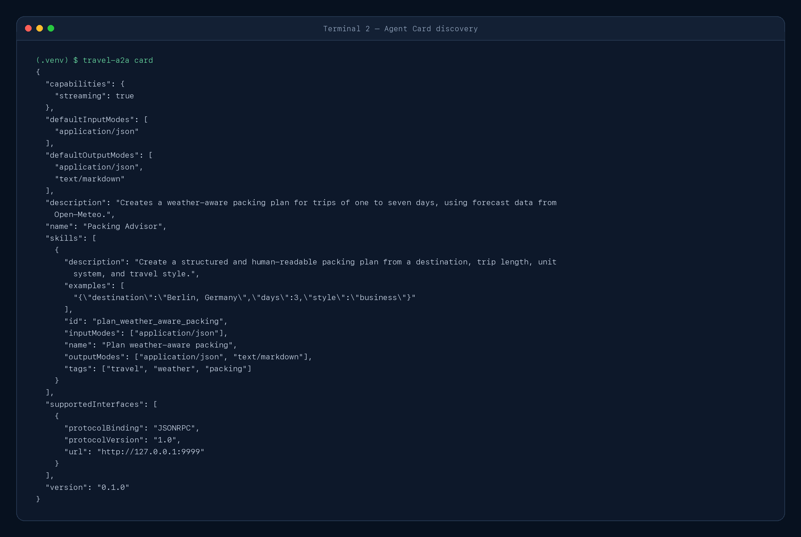

*The coordinator validates A2A 1.0, JSON-RPC, streaming, media modes, and the advertised packing
skill. Captured from a verified run on 2026-09-04.*

```json
{
  "capabilities": {"streaming": true},
  "defaultInputModes": ["application/json"],
  "defaultOutputModes": ["application/json", "text/markdown"],
  "description": "Creates a weather-aware packing plan for trips of one to seven days, using forecast data from Open-Meteo.",
  "name": "Packing Advisor",
  "skills": [
    {
      "description": "Create a structured and human-readable packing plan from a destination, trip length, unit system, and travel style.",
      "examples": ["{\"destination\":\"Berlin, Germany\",\"days\":3,\"style\":\"business\"}"],
      "id": "plan_weather_aware_packing",
      "inputModes": ["application/json"],
      "name": "Plan weather-aware packing",
      "outputModes": ["application/json", "text/markdown"],
      "tags": ["travel", "weather", "packing"]
    }
  ],
  "supportedInterfaces": [
    {
      "protocolBinding": "JSONRPC",
      "protocolVersion": "1.0",
      "url": "http://127.0.0.1:9999"
    }
  ],
  "version": "0.1.0"
}
```

### A skill is descriptive metadata, not a callable method

This is the most important Agent Card subtlety in the tutorial.

`plan_weather_aware_packing` helps a coordinator decide whether this agent is a sensible delegate.
It can include a name, prose description, tags, examples, and input/output modes. The coordinator
does **not** send `CallSkill("plan_weather_aware_packing")`—A2A 1.0 has no such core operation.

The actual interaction is:

1. Discover and evaluate the card.
2. Select one advertised interface.
3. Send a Message expressing the goal and data.
4. Let the remote agent route and execute the work internally.

Skills are claims made by the remote endpoint, not proof of safety or authorization.

---

## 8. Translate a Message into a Task lifecycle

The protocol-facing heart of the server is
[`PackingAgentExecutor`](../src/travel_a2a/executor.py), an implementation of the SDK's
`AgentExecutor` interface.

The SDK gives `execute(...)` a `RequestContext` and an `EventQueue`. The executor:

1. requires a user-role Message and validates the incoming data Part;
2. creates or resumes a Task;
3. uses `TaskUpdater` to publish ordered updates;
4. asks for input, rejects, works, fails, or completes; and
5. places the `PackingPlan` in an Artifact before completion.

### The event-order rule

A2A SDK 1.x strictly separates two response patterns:

- one stateless Message; or
- a Task stream beginning with the initial `Task`, followed by status/artifact updates.

This project always uses the second pattern. For a new request, the executor first emits the Task
created by `new_task_from_user_message(...)`. That Task is `SUBMITTED`. Only then does it call
`TaskUpdater` methods that generate status or Artifact events.

```text
Task(SUBMITTED)
    ↓
TaskStatusUpdateEvent(WORKING)
    ↓
TaskArtifactUpdateEvent(packing-plan)
    ↓
TaskStatusUpdateEvent(COMPLETED)
```

Emitting a status update before the initial Task is a protocol error in SDK 1.x. Mixing a plain
Message into a Task-mode stream is also an error.

A continuation is different because the client already has the Task from an earlier exchange.
Task-first remains the normative lifecycle model, but `a2a-sdk==1.1.2` can expose a continued
request either by repeating the current Task first or by yielding updates for that already-known
Task. The coordinator accepts both SDK shapes only when the Task and context IDs exactly match the
continuation it sent. It never accepts an update-first stream for a brand-new Task. The sequence
diagrams show logical state, not a promise that every continuation repeats the Task snapshot.

### Complete request

For a valid request with `days`, the executor starts work, gets a forecast, gets advice, builds the
plan, attaches the two-part Artifact, and completes:

```text
SUBMITTED → WORKING → packing-plan Artifact → COMPLETED
```

The completed state comes after the Artifact. A client must not infer success merely because an
Artifact event arrived.

### Missing trip length

If `days` is absent, the request is valid but incomplete. The Task pauses:

```text
SUBMITTED → INPUT_REQUIRED
```

The status carries an agent Message asking for a value from one to seven. The coordinator resends
a complete `PackingRequest` as a data Part and sets both `taskId` and `contextId` to the values the
server issued. The existing Task resumes rather than creating unrelated work.

### Unknown location

The input schema can validate a destination string without proving the geocoder recognizes it.
Consequently this path begins working, reaches the provider, then pauses:

```text
SUBMITTED → WORKING → INPUT_REQUIRED
```

The coordinator asks for a more specific destination and resends the updated complete request on
the same Task and context.

### Rejection and failure are different

An invalid Message or unsupported media/input contract maps to `REJECTED`: the agent understands
the request boundary but will not perform that work.

A provider or planner failure maps to `FAILED`: the agent accepted the work but could not finish
it. The status exposes a generic diagnostic; private exceptions stay on the server side.

| Condition | State | Caller action |
|---|---|---|
| Missing `days` | `INPUT_REQUIRED` | Supply days and continue the same Task. |
| Unknown location | `INPUT_REQUIRED` | Supply a more specific destination and continue. |
| Invalid schema/media | `REJECTED` | Correct the request contract. |
| Provider/planner unavailable | `FAILED` | Retry later or investigate the server. |

---

## 9. Assemble the Starlette server

The A2A SDK 1.x no longer needs the older `A2AStarletteApplication` wrapper found in many early
tutorials. This project builds routes directly:

```python
handler = DefaultRequestHandler(
    agent_executor=executor,
    task_store=InMemoryTaskStore(),
    agent_card=agent_card,
)

routes = [
    *create_agent_card_routes(agent_card),
    *create_jsonrpc_routes(handler, rpc_url="/"),
]
app = Starlette(routes=routes)
```

The complete factory in [`server.py`](../src/travel_a2a/server.py) accepts injected forecast and
planner dependencies for tests. Production defaults use `OpenMeteoForecastService` and the planner
selected by configuration.

The two visible routes have different jobs:

| Route | Method | Purpose |
|---|---|---|
| `/.well-known/agent-card.json` | `GET` | Return public discovery metadata. |
| `/` | `POST` | Receive A2A 1.0 JSON-RPC operations. |

Start with defaults:

```bash
travel-a2a-server
```

Or choose the listening address, advertised URL, and planner explicitly:

```bash
travel-a2a-server \
  --host 127.0.0.1 \
  --port 9999 \
  --public-url http://127.0.0.1:9999 \
  --planner deterministic
```

`--host` says where Uvicorn listens. `--public-url` is what clients will read from the Agent Card.
They are related but not interchangeable behind a reverse proxy.

`InMemoryTaskStore` is ideal for a single-process tutorial. Restarting the server loses Tasks, and
multiple replicas would not share state. Use a durable, owner-aware store before treating Tasks as
production records.

---

## 10. Discover defensively in the coordinator

The Trip Coordinator in [`coordinator.py`](../src/travel_a2a/coordinator.py) uses
`A2ACardResolver` to fetch the well-known card, validates it as untrusted input, then creates an
SDK client with `ClientFactory` and `ClientConfig`.

Discovery is more than “JSON parsed successfully.” This coordinator requires:

- an advertised A2A `1.0` interface;
- the `JSONRPC` protocol binding;
- `application/json` input;
- `application/json` and `text/markdown` output;
- the streaming capability promised by this project's fixed Agent Card contract; and
- interface URLs whose origin matches the origin the user requested.

It also validates Task transitions, identifiers, status-message media and terminal safety,
Artifact identity/order, the JSON `PackingPlan`, and exact equality between remote Markdown and
the locally regenerated rendering. A MIME type or successful schema parse alone does not make
remote presentation text safe.

### Why reject a cross-origin interface?

Suppose you ask for a card from `http://127.0.0.1:9999`, but the returned card says to send your
full request to `https://unexpected.example`. Blindly following that URL turns discovery into an
SSRF/data-exfiltration primitive.

This sample applies a deliberately narrow trust policy: the scheme, host, and effective port of
each accepted interface must match the originally requested agent origin. Redirects, DNS rebinding,
private network policy, signed cards, and registries require broader production controls; the
same-origin check is a teaching-safe starting point, not a complete network sandbox.

The URL used for discovery follows this precedence:

1. `--agent-url`
2. `A2A_AGENT_URL`
3. `http://127.0.0.1:9999`

---

## 11. Send a Message and validate the Artifact

The coordinator sends a user Message whose Part contains the `PackingRequest` as structured data.
The SDK helper `new_data_message(...)` creates the request Message. On the server,
`new_data_part(...)` creates the Artifact's structured Part. The client owns the message ID, while
the server owns new task and context IDs.

### Non-streaming request

Try a complete request:

```bash
travel-a2a plan "Berlin, Germany" --days 3
```

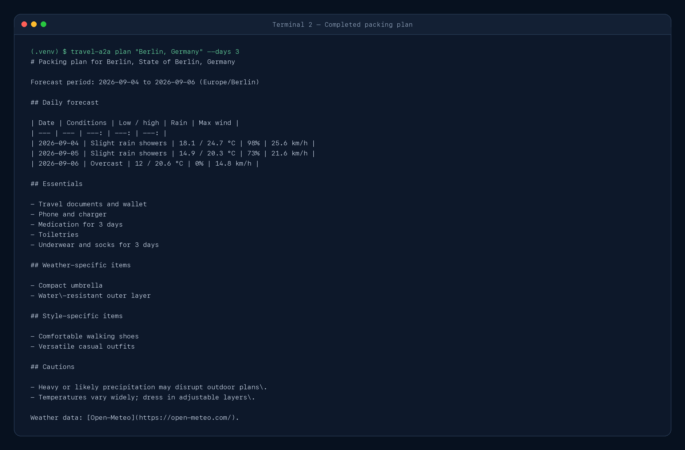

*A complete request produces a weather-aware packing plan without requiring an LLM. This verified
capture is from 2026-09-04; live forecast dates and values will change.*

```text
(.venv) $ travel-a2a plan "Berlin, Germany" --days 3
# Packing plan for Berlin, State of Berlin, Germany

Forecast period: 2026-09-04 to 2026-09-06 (Europe/Berlin)

## Daily forecast

| Date | Conditions | Low / high | Rain | Max wind |
| --- | --- | ---: | ---: | ---: |
| 2026-09-04 | Slight rain showers | 18.1 / 24.7 °C | 98% | 25.6 km/h |
| 2026-09-05 | Slight rain showers | 14.9 / 20.3 °C | 73% | 21.6 km/h |
| 2026-09-06 | Overcast | 12 / 20.6 °C | 0% | 14.8 km/h |

## Essentials

- Travel documents and wallet
- Phone and charger
- Medication for 3 days
- Toiletries
- Underwear and socks for 3 days

## Weather-specific items

- Compact umbrella
- Water\-resistant outer layer

## Style-specific items

- Comfortable walking shoes
- Versatile casual outfits

## Cautions

- Heavy or likely precipitation may disrupt outdoor plans\.
- Temperatures vary widely; dress in adjustable layers\.

Weather data: [Open-Meteo](https://open-meteo.com/).
```

The coordinator does not trust the first text it sees. It verifies that the response is a Task,
checks its terminal state, finds exactly the expected `packing-plan` Artifact, confirms Part media
types and order, and validates the data Part as `PackingPlan`. It regenerates Markdown from that
validated plan and requires an exact match. The remote Markdown is a presentation companion, not
the source of truth.

### Structured JSON output

```bash
travel-a2a plan "São Paulo, Brazil" --days 3 --json
```

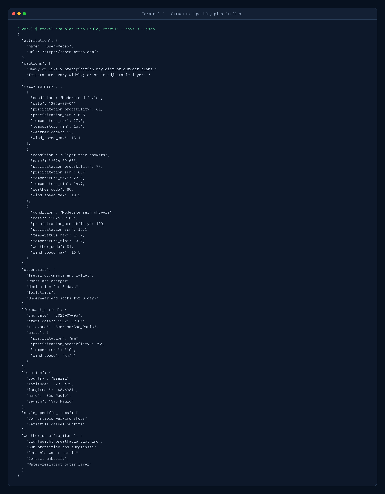

*The first Artifact Part is validated structured JSON for software consumers. This verified
capture is from 2026-09-04; Unicode is preserved and live forecast values will change.*

```json
{
  "attribution": {"name": "Open-Meteo", "url": "https://open-meteo.com/"},
  "cautions": [
    "Heavy or likely precipitation may disrupt outdoor plans.",
    "Temperatures vary widely; dress in adjustable layers."
  ],
  "daily_summary": [
    {
      "condition": "Moderate drizzle",
      "date": "2026-09-04",
      "precipitation_probability": 81,
      "precipitation_sum": 0.5,
      "temperature_max": 27.7,
      "temperature_min": 16.4,
      "weather_code": 53,
      "wind_speed_max": 13.1
    },
    {
      "condition": "Slight rain showers",
      "date": "2026-09-05",
      "precipitation_probability": 97,
      "precipitation_sum": 8.7,
      "temperature_max": 22.8,
      "temperature_min": 14.9,
      "weather_code": 80,
      "wind_speed_max": 10.5
    },
    {
      "condition": "Moderate rain showers",
      "date": "2026-09-06",
      "precipitation_probability": 100,
      "precipitation_sum": 15.1,
      "temperature_max": 16.7,
      "temperature_min": 10.9,
      "weather_code": 81,
      "wind_speed_max": 16.5
    }
  ],
  "essentials": [
    "Travel documents and wallet",
    "Phone and charger",
    "Medication for 3 days",
    "Toiletries",
    "Underwear and socks for 3 days"
  ],
  "forecast_period": {
    "end_date": "2026-09-06",
    "start_date": "2026-09-04",
    "timezone": "America/Sao_Paulo",
    "units": {
      "precipitation": "mm",
      "precipitation_probability": "%",
      "temperature": "°C",
      "wind_speed": "km/h"
    }
  },
  "location": {
    "country": "Brazil",
    "latitude": -23.5475,
    "longitude": -46.63611,
    "name": "São Paulo",
    "region": "São Paulo"
  },
  "style_specific_items": [
    "Comfortable walking shoes",
    "Versatile casual outfits"
  ],
  "weather_specific_items": [
    "Lightweight breathable clothing",
    "Sun protection and sunglasses",
    "Reusable water bottle",
    "Compact umbrella",
    "Water-resistant outer layer"
  ]
}
```

The exact values will change with the weather. The schema will not: normalized location, forecast
period, daily summary, four recommendation lists, and attribution remain stable.

### Stream ordered updates

```bash
travel-a2a plan "Reykjavík, Iceland" --days 4 --style outdoors --stream
```

The JSON-RPC streaming operation returns an HTTP `text/event-stream`. Each SSE data item wraps one
ordered A2A stream response: the initial Task, status changes, or an Artifact update. The SDK
decodes framing; the coordinator still validates every event.

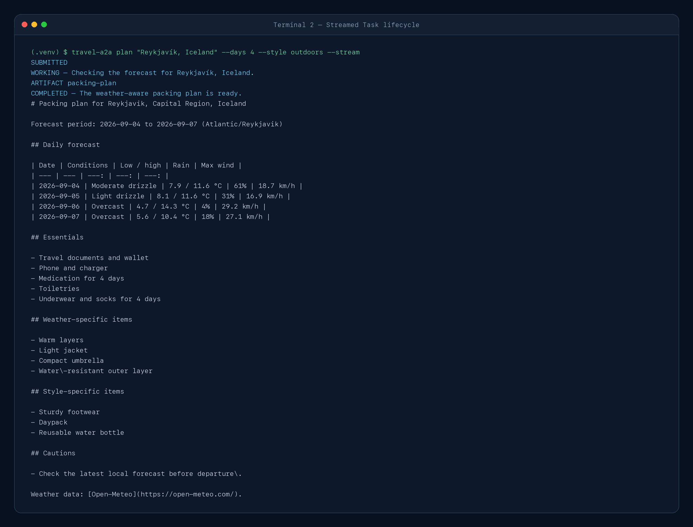

*Streaming exposes ordered Task, status, Artifact, and completion events over SSE. This verified
capture is from 2026-09-04; no artificial delay was added.*

```text
(.venv) $ travel-a2a plan "Reykjavík, Iceland" --days 4 --style outdoors --stream
SUBMITTED
WORKING — Checking the forecast for Reykjavík, Iceland.
ARTIFACT packing-plan
COMPLETED — The weather-aware packing plan is ready.
# Packing plan for Reykjavik, Capital Region, Iceland

Forecast period: 2026-09-04 to 2026-09-07 (Atlantic/Reykjavik)

## Daily forecast

| Date | Conditions | Low / high | Rain | Max wind |
| --- | --- | ---: | ---: | ---: |
| 2026-09-04 | Moderate drizzle | 7.9 / 11.6 °C | 61% | 18.7 km/h |
| 2026-09-05 | Light drizzle | 8.1 / 11.6 °C | 31% | 16.9 km/h |
| 2026-09-06 | Overcast | 4.7 / 14.3 °C | 4% | 29.2 km/h |
| 2026-09-07 | Overcast | 5.6 / 10.4 °C | 18% | 27.1 km/h |

## Essentials

- Travel documents and wallet
- Phone and charger
- Medication for 4 days
- Toiletries
- Underwear and socks for 4 days

## Weather-specific items

- Warm layers
- Light jacket
- Compact umbrella
- Water\-resistant outer layer

## Style-specific items

- Sturdy footwear
- Daypack
- Reusable water bottle

## Cautions

- Check the latest local forecast before departure\.

Weather data: [Open-Meteo](https://open-meteo.com/).
```

With `--stream --json`, trace information goes to standard error and only the validated structured
Artifact JSON goes to standard output. That keeps pipelines usable:

```bash
travel-a2a plan "Berlin, Germany" --days 3 --stream --json > plan.json
```

### Continue after `INPUT_REQUIRED`

Run the request in an interactive terminal and omit `--days`:

```bash
travel-a2a plan "Tokyo, Japan"
```

The CLI reads the status Message, prompts `Days (1-7)`, and resends a complete request with the
same Task and context identifiers. An unknown location follows the same pattern with a prompt for
a more specific destination.

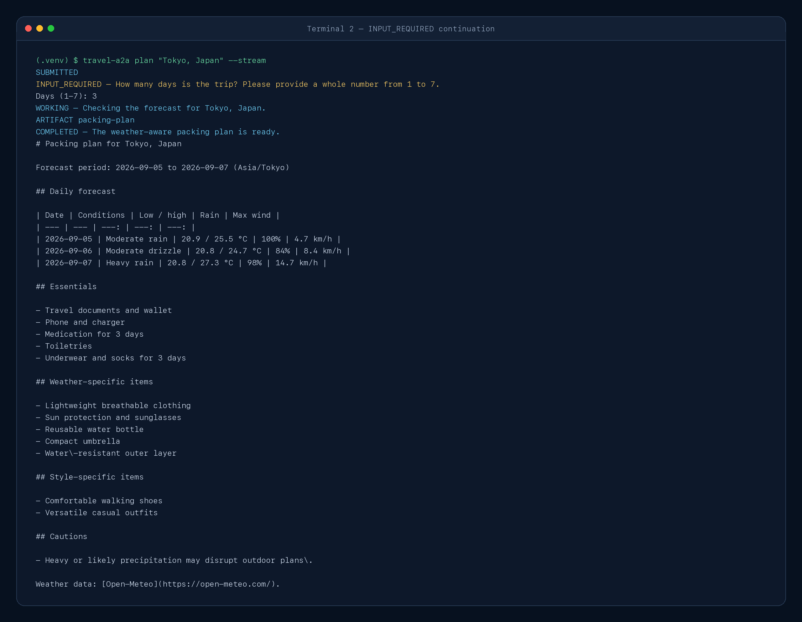

*The coordinator supplies missing days and resumes the same server-owned Task and context. This
verified capture is from 2026-09-04; the CLI does not print opaque IDs, while tests assert that the
continuation preserves both IDs.*

```text
(.venv) $ travel-a2a plan "Tokyo, Japan" --stream
SUBMITTED
INPUT_REQUIRED — How many days is the trip? Please provide a whole number from 1 to 7.
Days (1-7): 3
WORKING — Checking the forecast for Tokyo, Japan.
ARTIFACT packing-plan
COMPLETED — The weather-aware packing plan is ready.
# Packing plan for Tokyo, Japan

Forecast period: 2026-09-05 to 2026-09-07 (Asia/Tokyo)

## Daily forecast

| Date | Conditions | Low / high | Rain | Max wind |
| --- | --- | ---: | ---: | ---: |
| 2026-09-05 | Moderate rain | 20.9 / 25.5 °C | 100% | 4.7 km/h |
| 2026-09-06 | Moderate drizzle | 20.8 / 24.7 °C | 84% | 8.4 km/h |
| 2026-09-07 | Heavy rain | 20.8 / 27.3 °C | 98% | 14.7 km/h |

## Essentials

- Travel documents and wallet
- Phone and charger
- Medication for 3 days
- Toiletries
- Underwear and socks for 3 days

## Weather-specific items

- Lightweight breathable clothing
- Sun protection and sunglasses
- Reusable water bottle
- Compact umbrella
- Water\-resistant outer layer

## Style-specific items

- Comfortable walking shoes
- Versatile casual outfits

## Cautions

- Heavy or likely precipitation may disrupt outdoor plans\.

Weather data: [Open-Meteo](https://open-meteo.com/).
```

If standard input is not interactive, do not rely on prompting: provide `--days` up front.

---

## 12. Peek under the SDK: what travels over `/`?

Use the SDK in application code; it handles version headers, protobuf-derived types, JSON mapping,
and SSE framing. Still, seeing the wire shape once makes the abstraction concrete.

### A2A 1.0 over JSON-RPC 2.0

The HTTP request carries `A2A-Version: 1.0`. Its body uses a JSON-RPC 2.0 envelope. A simplified
non-streaming request looks like this:

```http
POST / HTTP/1.1
Host: 127.0.0.1:9999
Content-Type: application/json
A2A-Version: 1.0
```

```json
{
  "jsonrpc": "2.0",
  "id": "request-id",
  "method": "SendMessage",
  "params": {
    "message": {
      "messageId": "client-message-id",
      "role": "ROLE_USER",
      "parts": [
        {
          "mediaType": "application/json",
          "data": {
            "destination": "Berlin, Germany",
            "days": 3,
            "units": "metric",
            "style": "general"
          }
        }
      ]
    }
  }
}
```

The identifiers above are schematic, not captured program output. Exact serialization details are
owned by the pinned SDK and the A2A 1.0 schema.

The successful response contains a Task rather than invoking the Agent Card skill by ID:

```json
{
  "jsonrpc": "2.0",
  "id": "request-id",
  "result": {
    "task": {
      "id": "server-task-id",
      "contextId": "server-context-id",
      "status": {"state": "TASK_STATE_COMPLETED"},
      "artifacts": [
        {
          "artifactId": "server-artifact-id",
          "name": "packing-plan",
          "parts": [
            {"mediaType": "application/json", "data": {"...": "PackingPlan"}},
            {"mediaType": "text/markdown", "text": "# Packing plan ..."}
          ]
        }
      ]
    }
  }
}
```

### Streaming changes the delivery, not the model

`SendStreamingMessage` uses the same request data. The response is SSE:

```http
HTTP/1.1 200 OK
Content-Type: text/event-stream

data: {"jsonrpc":"2.0","id":"...","result":{"task":{"...":"SUBMITTED"}}}

data: {"jsonrpc":"2.0","id":"...","result":{"statusUpdate":{"...":"WORKING"}}}

data: {"jsonrpc":"2.0","id":"...","result":{"artifactUpdate":{"...":"packing-plan"}}}

data: {"jsonrpc":"2.0","id":"...","result":{"statusUpdate":{"...":"COMPLETED"}}}
```

This stream is schematic. Use a verified capture for tutorial output and the official schema for
normative field names. A2A requires events to be delivered in generation order.

### Messages communicate; Artifacts deliver results

Status Messages explain progress or request input. The packing plan is an Artifact because it is
the concrete product of the task. Do not bury a machine-consumable result only inside a friendly
status sentence.

---

## 13. Inspect the agent independently

[A2A Inspector](https://github.com/a2aproject/a2a-inspector) gives you a visual client independent
of this project's coordinator. Its current local workflow needs Python, `uv`, Node.js, and npm.
Clone it into a separate working directory, not inside this topic:

```bash
git clone https://github.com/a2aproject/a2a-inspector.git
cd a2a-inspector
uv sync
cd frontend
npm install
cd ..
bash scripts/run.sh
```

Open `http://127.0.0.1:5001`, then point Inspector at:

```text
http://127.0.0.1:9999
```

Use it to:

1. retrieve `/.well-known/agent-card.json`;
2. inspect the A2A 1.0 interface using the JSON-RPC binding and advertised skill;
3. inspect the raw JSON-RPC console; and
4. independently verify that a plain chat Message is rejected because this agent advertises and
   requires an `application/json` data Part.

At the time of this project's verification, Inspector's chat composer creates text/file Parts and
does not provide a general structured data-Part editor; related UI work is tracked in the
[Inspector repository](https://github.com/a2aproject/a2a-inspector/issues/131). If the release you
install adds a structured JSON Part editor, send the `PackingRequest` object and inspect the
completed JSON/Markdown Artifact. Otherwise, use `travel-a2a plan` for the complete task and use
Inspector for discovery, raw protocol visibility, and the expected media-contract rejection.

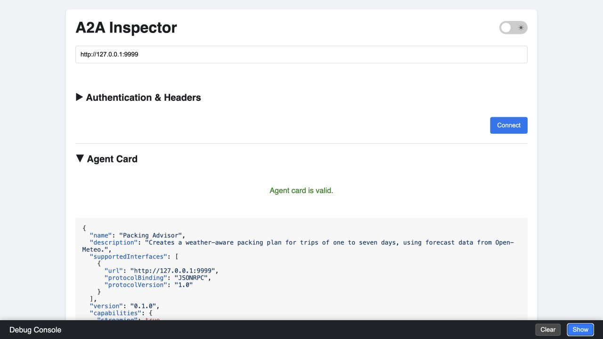

*A2A Inspector independently discovers the agent and validates its card. Captured on 2026-09-04
from Inspector commit `8aa064639af106ff771d60428ef6d460f5454743`.*

```text
Verified Inspector view
- Agent URL: http://127.0.0.1:9999
- Discovery result: Agent card is valid
- Agent: Packing Advisor, version 0.1.0
- Supported interface: JSONRPC at http://127.0.0.1:9999
- Protocol version: 1.0
- Streaming capability: enabled
- Advertised skill: plan_weather_aware_packing

The verified view is the Agent Card page. The raw JSON-RPC console is available from Inspector's
sidebar. This Inspector build's chat composer does not expose a general application/json data-Part
editor, so the complete structured request/Artifact flow was exercised with travel-a2a and the
official-SDK in-process tests instead of misrepresenting a text chat as a valid request.
```

Inspector's README also documents a Docker workflow. Container-to-host addressing differs by
platform, so use the local workflow above for the simplest loopback connection to this project.

An independent discovery/validation client is useful evidence even when its composer cannot author
this application's data contract. The in-process contract tests provide the full independent A2A
client check by running the official SDK client against the Starlette server.

---

## 14. Use the optional OpenAI planner

The A2A topology does not change when the advisor swaps internal planners:

```text
Trip Coordinator --A2A--> Packing Advisor --internal call--> selected planner
```

Install the extra, export configuration in the **server** shell, and start the server:

```bash
python -m pip install -e ".[ai,dev]"
export OPENAI_API_KEY="your-key"
export OPENAI_MODEL="gpt-5.6"
travel-a2a-server --planner openai
```

Or select it with `PACKING_PLANNER=openai`. A command-line value takes precedence over the
environment, which takes precedence over the deterministic default.

The client command remains exactly the same:

```bash
travel-a2a plan "London, United Kingdom" --days 3 --style business
```

That opacity is intentional. A2A peers collaborate through Messages, Tasks, and Artifacts without
requiring the remote agent to reveal its internal framework or model.

No automated test makes a paid request. Planner tests inject a fake Responses client and verify
the request plus `PackingAdvice` validation.

---

## 15. Test every boundary without flaky network calls

Normal tests are deterministic and offline:

```bash
pytest
ruff check .
ruff format --check .
```

The suite covers these boundaries:

- **Models:** strict types, destination length, day range, units/style enums, consecutive daily
  forecasts, temperature ranges, period consistency, Unicode, control-character rejection, and
  escaped Markdown rendering.
- **Provider:** geocoding and daily forecast query parameters, exact metric/imperial unit labels,
  strict numeric response validation, WMO mapping, attribution, no match, HTTP/JSON failures,
  timeouts, unexpected exceptions, and safe errors.
- **Planner:** deterministic weather/style thresholds, duplicate-free recommendations, plan
  assembly, optional Responses request shape, structured parsing, and safe planner failures.
- **Executor:** user-role enforcement, Task-first event ordering, all lifecycle paths, one Artifact
  with ordered media types, sanitized diagnostics, and same-ID continuation.
- **Agent Card/server:** well-known route, JSON-RPC interface, protocol version, advertised modes,
  streaming capability, and injected dependencies.
- **Coordinator/CLI:** URL precedence, same-origin interface validation, card/media/task validation,
  both valid continuation-stream shapes, status terminal safety, exact Markdown equivalence,
  non-streaming aggregation, stream ordering, human/JSON output, prompt/resume behavior, malformed
  remote events, and connection errors.
- **End to end:** the official A2A client talks to the Starlette app through in-process ASGI
  transport while forecast and planner dependencies remain fake.

The separately gated live smoke test calls only Open-Meteo:

```bash
RUN_LIVE_TESTS=1 pytest -m live -q
```

It checks stable types, bounds, ordering, unit labels, and attribution rather than exact changing
forecast values.

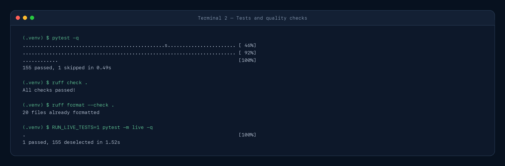

*Offline tests and quality checks verify each boundary; the changing-weather smoke test stays
opt-in. Captured from the verified acceptance run on 2026-09-04.*

```text
(.venv) $ pytest -q
................................................s....................... [ 46%]
........................................................................ [ 92%]
............                                                             [100%]
155 passed, 1 skipped in 0.49s

(.venv) $ ruff check .
All checks passed!

(.venv) $ ruff format --check .
20 files already formatted

(.venv) $ RUN_LIVE_TESTS=1 pytest -m live -q
.                                                                        [100%]
1 passed, 155 deselected in 1.52s
```

---

## 16. Troubleshooting

### `travel-a2a-server: command not found`

Activate the intended virtual environment and reinstall the topic:

```bash
source .venv/bin/activate
python -m pip install -e ".[dev]"
```

Use `.[ai,dev]` if you also need the optional planner.

### `Address already in use`

Another process owns port 9999. Inspect it before stopping anything, or choose another port and
keep the public/client URLs aligned:

Terminal 1:

```bash
travel-a2a-server --port 10000 --public-url http://127.0.0.1:10000
```

Terminal 2:

```bash
travel-a2a card --agent-url http://127.0.0.1:10000
```

### `Connection refused`

Confirm the server is running and check for an environment override:

```bash
echo "$A2A_AGENT_URL"
travel-a2a card --agent-url http://127.0.0.1:9999
```

### Agent Card or interface validation fails

The card may advertise the wrong protocol version, binding, media types, or origin. Make
`A2A_PUBLIC_URL`/`--public-url` match the URL through which the coordinator reaches this local
agent. Do not disable the checks merely to follow an unexpected remote URL.

### The wrong city is selected

This learning adapter deliberately takes the geocoder's first match. Add a region or country:

```bash
travel-a2a plan "Paris, France" --days 3
travel-a2a plan "Springfield, Illinois" --days 2
```

### The Task asks for input in a script

Interactive continuation needs standard input. For automation, provide `--days` and a specific
destination up front. A more advanced client could handle `INPUT_REQUIRED` through its own UI or
workflow engine.

### The provider or planner fails

The peer-facing status is intentionally generic. Retry later, then use private server logs and
observability to diagnose the provider/model without returning secrets or raw responses through
A2A.

### Streaming is unavailable

The coordinator checks `AgentCard.capabilities.streaming` before opening a stream. Use the normal
request/response path or connect to an interface that truthfully advertises streaming support.

### The OpenAI planner is unavailable

Install `.[ai]`, export `OPENAI_API_KEY` in the server's shell, and select a model available to
your account. The key is not needed for the deterministic planner or any coordinator command.

---

## 17. Security and production boundaries

This is a loopback teaching agent, not a production deployment template. It deliberately omits
authentication, authorization, TLS termination, push notifications, persistent storage,
cancellation, multi-tenant ownership, rate limiting, and distributed coordination.

Before exposing a real A2A agent:

- serve discovery and agent interfaces over HTTPS;
- authenticate callers and authorize the requested action, Task, context, and Artifact;
- keep credentials in HTTP authorization mechanisms or a secret manager, never in Agent Cards;
- validate Agent Cards, Messages, Parts, media types, task events, Artifacts, provider data, and
  model output;
- use an allowlist/trust policy for advertised interface URLs and protect against SSRF, redirects,
  DNS rebinding, and private-network access;
- treat skill descriptions, status text, and Artifact text as potentially prompt-injecting
  content;
- reject terminal control sequences before printing remote status and require presentation
  Markdown to match a locally regenerated rendering of validated data;
- validate file URLs and raw attachments before fetching or decoding them;
- bound payload size, task duration, concurrency, retries, and downstream cost;
- persist Tasks in an owner-aware durable store and enforce access on every read/update;
- use rate limits, audit logs, metrics, tracing, and safe correlation IDs;
- avoid logging prompts, locations, task history, credentials, or Artifacts unless policy allows;
- define retention and deletion rules for Task history and generated work;
- sign or otherwise establish trust in Agent Cards where your environment requires it; and
- design human approval for sensitive, costly, or state-changing work.

The A2A specification uses normal web authentication; credentials are sent outside the A2A
Message body, typically in HTTP headers. A public Agent Card should not contain secrets or internal
implementation details. An authenticated extended card is the appropriate place for sensitive
capability metadata when needed.

Binding to `127.0.0.1` is a safe local default. Binding to `0.0.0.0` only changes reachability; it
does not add any of the controls above.

---

## 18. What to build next

Change one boundary at a time:

1. **Use the MCP weather server internally.** Replace direct Open-Meteo calls with the repository's
   MCP topic and observe how A2A and MCP compose.
2. **Offer geocoding choices.** Return candidate locations and resume the same Task after the user
   selects one.
3. **Persist Tasks.** Replace `InMemoryTaskStore` with a durable, owner-aware store and test restart
   behavior.
4. **Add cancellation.** Advertise and implement it for a genuinely long-running planner.
5. **Add authentication.** Protect both Task operations and any extended Agent Card.
6. **Add another remote agent.** Let the Trip Coordinator delegate to separate flight, lodging,
   and packing agents while preserving clear context boundaries.
7. **Support another binding.** Add REST or gRPC only after the JSON-RPC lifecycle is familiar.
8. **Add observability.** Trace card discovery, queue time, geocoding, forecasting, planning, and
   end-to-end Task duration without logging sensitive payloads.

Push notifications are useful for very long-running work but deliberately out of scope here. So
are future-date itineraries beyond the provider's next seven forecast days.

---

## 19. Recap

You built and exercised the complete A2A loop:

1. Strict Pydantic models defined request, forecast, advice, and Artifact contracts.
2. An Open-Meteo adapter turned a destination into a validated daily forecast.
3. A deterministic planner produced key-free advice; an optional OpenAI planner implemented the
   same advice-only interface.
4. An Agent Card advertised A2A 1.0, JSON-RPC, streaming, media modes, and one descriptive skill.
5. `AgentExecutor` and `TaskUpdater` produced an ordered stateful Task lifecycle.
6. Missing information paused work in `INPUT_REQUIRED` and resumed on the same Task/context.
7. A two-Part `packing-plan` Artifact served software and people without sentence parsing.
8. A defensive coordinator validated cards, origins, events, states, media types, and plan data.
9. Request/response and SSE streaming delivered the same Task semantics.
10. Offline fakes tested each boundary without changing weather or paid model calls.

The core idea is simple:

```text
discover an agent → send a goal → track its Task → validate its Artifact
```

A2A lets the remote agent remain opaque while making collaboration explicit and interoperable.

## Official references

- [A2A Protocol 1.0 specification](https://a2a-protocol.org/latest/specification/)
- [A2A core concepts](https://a2a-protocol.org/latest/topics/key-concepts/)
- [Life of a Task](https://a2a-protocol.org/latest/topics/life-of-a-task/)
- [Agent discovery](https://a2a-protocol.org/latest/topics/agent-discovery/)
- [Streaming and asynchronous operations](https://a2a-protocol.org/latest/topics/streaming-and-async/)
- [A2A and MCP comparison](https://a2a-protocol.org/latest/topics/a2a-and-mcp/)
- [A2A Python SDK](https://github.com/a2aproject/a2a-python)
- [A2A Python SDK 1.0 migration guide](https://github.com/a2aproject/a2a-python/tree/main/docs/migrations/v1_0)
- [A2A Inspector](https://github.com/a2aproject/a2a-inspector)
- [Open-Meteo geocoding documentation](https://open-meteo.com/en/docs/geocoding-api)
- [Open-Meteo forecast documentation](https://open-meteo.com/en/docs)
- [Open-Meteo terms](https://open-meteo.com/en/terms)
- [OpenAI Responses API](https://platform.openai.com/docs/api-reference/responses)
