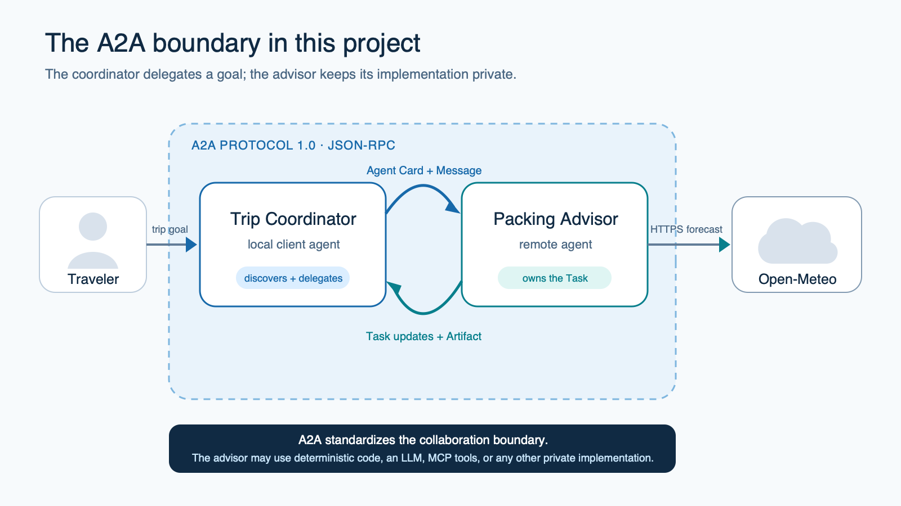
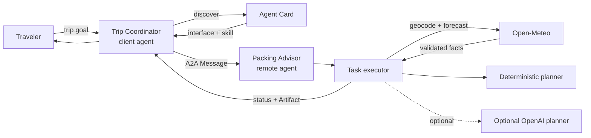
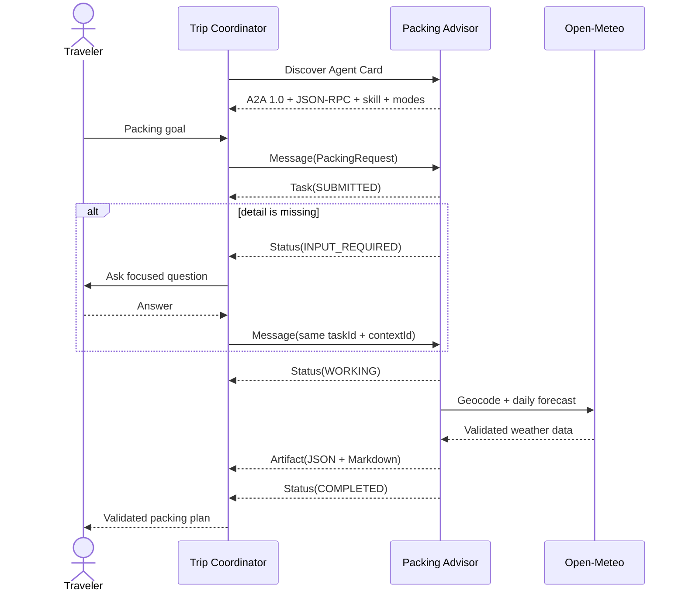

# I Don’t Know What A2A is, and at This Point I’m Too Afraid to Ask — A Judgement-Free Tutorial

## A2A for mere mortals: let’s build two agents that discover each other, manage a real task, ask a follow-up question, and return a weather-aware packing plan

GitHub repository: [github.com/adnanmasood/too-afraid-to-ask](https://github.com/adnanmasood/too-afraid-to-ask/)

Somewhere between “single-agent demo” and “enterprise agent platform,” A2A became a term people
started using as though everyone had attended the same meeting.

They had not.

Maybe you have seen an architecture slide with several colorful agent boxes and arrows labeled
“A2A.” Maybe someone said, “MCP is for tools; A2A is for agents,” and the room moved on before you
could ask what that means in code. Maybe you already understand APIs, JSON, and Python, but the
words *Agent Card*, *Task*, *Artifact*, and *context ID* arrived all at once.

This is the quiet, judgement-free way out.

We are going to build a small but real Agent2Agent system in Python. A **Trip Coordinator** will
discover a remote **Packing Advisor**, send it a request, watch a Task move through its lifecycle,
handle a follow-up question, and validate a two-part packing-plan Artifact. The advisor will call
Open-Meteo for a live forecast and use deterministic rules by default. No LLM or API key is
required. At the end, we will add an optional OpenAI planner without changing the A2A boundary.

I wrote this for someone comfortable with basic Python—functions, classes, `pip install`—who has
never built an A2A client or server. Every protocol term gets a plain definition when it first
appears.



*The Trip Coordinator delegates through A2A while the remote Packing Advisor keeps its weather and
planning implementation private.*

---

## What A2A is, in one paragraph

A **protocol** is an agreed set of rules that lets two programs communicate. HTTP is a protocol.
So is SMTP, which email systems use. The **Agent2Agent Protocol**, or **A2A**, defines how a client
agent discovers a remote agent, sends it messages, tracks stateful work, receives updates, supplies
more input, and collects results. The agents can be built by different teams, with different
frameworks, tools, and models. From each other's perspective, they are intentionally opaque.

An **agent** here means a software system that can accept a goal and decide how to pursue it. It may
use a language model, deterministic code, a workflow engine, tools, or all of those together. A2A
does not require an LLM. It standardizes the boundary around the agent, not the contents inside it.

That last sentence is worth keeping:

> A2A standardizes how agents collaborate; it does not standardize how an agent thinks.

---

## What you will build

The project has three external actors:

```text
Traveler
   │
   ▼
Trip Coordinator  ───── A2A ─────►  Packing Advisor
 (client agent)                       (remote agent)
                                          │
                                          │ HTTPS
                                          ▼
                                      Open-Meteo
```

The Trip Coordinator will:

- fetch and validate the Packing Advisor's Agent Card;
- send a structured packing request;
- use request/response or streaming delivery;
- respond when the Task asks for missing information; and
- validate the returned Artifact instead of trusting arbitrary text.

The Packing Advisor will:

- publish one weather-aware packing skill;
- create and manage server-owned Tasks;
- call Open-Meteo for the next one to seven days;
- generate packing recommendations; and
- return one Artifact containing JSON and Markdown.

The complete code lives under [`topics/a2a`](https://github.com/adnanmasood/too-afraid-to-ask/tree/main/topics/a2a).

This project pins `a2a-sdk[http-server]==1.1.2` and targets A2A Protocol `1.0` over the JSON-RPC
`2.0` binding. Those two version numbers are not a typo: A2A 1.0 defines the agent semantics;
JSON-RPC 2.0 defines the request envelope.

---

## First, the vocabulary everyone keeps skipping

Here is the smallest useful glossary.

| Term | Meaning without the ceremony |
|---|---|
| Client agent | The program delegating work; ours is the Trip Coordinator. |
| Remote agent | The independent agent receiving work; ours is the Packing Advisor. |
| Agent Card | A JSON business card describing identity, interfaces, capabilities, security, and skills. |
| Skill | A description of work the agent says it can handle. It is not a method name. |
| Message | One turn of communication from a client/user or agent. |
| Part | A typed piece of Message or Artifact content: text, data, bytes, or URL. |
| Task | A server-owned unit of work with an ID and lifecycle state. |
| Context | A server-issued ID grouping related interactions. |
| Artifact | A concrete output produced by a Task. |
| SSE | Server-Sent Events, the HTTP stream used for live updates. |

If you can keep **card, message, task, artifact** straight, the rest becomes implementation detail.

---

## The mental model: hire a specialist, do not remote-control one

Imagine a travel coordinator hiring a packing specialist.

The specialist provides a business card: “I prepare weather-aware packing plans. Here is how to
contact me, what data I accept, what formats I return, and whether I can stream progress.”

The coordinator does not reach through the specialist's office door and invoke a private function
called `pick_rain_jacket()`. It delegates an outcome:

> Prepare a three-day business packing plan for Berlin in metric units.

The specialist decides how to do the work. It might call a weather API, consult a model, execute a
workflow, or hand the job to another internal system. The coordinator sees only the public A2A
contract and the Task's observable lifecycle.

That opacity is a feature. It lets the Packing Advisor change its internal implementation without
forcing every client agent to change.

### Complete architecture



The dashed branch is important: AI is optional. Both planners return the same small
`PackingAdvice` contract. Forecast facts remain owned by application code.

---

## Wait—is this MCP?

No, but the confusion is reasonable because the protocols belong in the same architecture.

The shortest useful distinction is:

```text
MCP: agent → tool
A2A: agent → agent
```

An MCP tool is usually a discrete capability with well-defined arguments and output: query a
database, fetch weather, calculate a route. An A2A agent accepts a broader goal and may reason,
plan, keep state, ask questions, and use several tools before producing a result.

| MCP | A2A |
|---|---|
| Discover tools/resources/prompts | Discover agents through Agent Cards |
| Invoke a named tool | Send a Message expressing a goal |
| Receive tool content | Track a Task and receive Artifacts |
| Internal operation is exposed as a capability | Internal reasoning/tools stay opaque |

They complement each other. Our Packing Advisor calls Open-Meteo directly so the topic runs by
itself. A natural next exercise is to make the advisor call the weather MCP server from the
repository. Its peers would still communicate with it through A2A.

---

## Install the project

From the repository root:

```bash
cd topics/a2a
python3 -m venv .venv
source .venv/bin/activate
python -m pip install --upgrade pip
python -m pip install -e ".[dev]"
```

On Windows PowerShell, activate with:

```powershell
.venv\Scripts\Activate.ps1
```

The core dependencies are pinned:

```toml
dependencies = [
  "a2a-sdk[http-server]==1.1.2",
  "httpx==0.28.1",
  "pydantic==2.13.5",
  "uvicorn==0.52.4",
]
```

The optional AI dependency stays in its own extra:

```toml
[project.optional-dependencies]
ai = ["openai==3.8.0"]
```

That separation is honest: a beginner should not have to install an AI SDK or obtain a paid key to
learn a transport protocol.

---

## See the finished behavior before the code

Start the remote agent in one terminal:

```bash
travel-a2a-server
```

It listens on the loopback interface at `http://127.0.0.1:9999`. Loopback means “this same
computer”; it is the right default for an unauthenticated teaching server.


*The local Packing Advisor publishes discovery and JSON-RPC endpoints on loopback port 9999.*

```text
Packing Advisor Agent Card: http://127.0.0.1:9999/.well-known/agent-card.json
Packing Advisor JSON-RPC: http://127.0.0.1:9999/
INFO: Uvicorn running on http://127.0.0.1:9999 (Press CTRL+C to quit)
```

In another terminal, discover it:

```bash
travel-a2a card
```


*The coordinator validates A2A 1.0, JSON-RPC, streaming, media modes, and the advertised packing
skill.*

**Abridged verified-output summary**

```text
name: Packing Advisor
capabilities.streaming: true
defaultInputModes: [application/json]
defaultOutputModes: [application/json, text/markdown]
supportedInterfaces[0]: JSONRPC, protocolVersion 1.0, http://127.0.0.1:9999
skills[0].id: plan_weather_aware_packing
```

Then delegate work:

```bash
travel-a2a plan "Berlin, Germany" --days 3
```


*A complete request produces a weather-aware packing plan without requiring an LLM.*

**Abridged verified-output summary**

```text
# Packing plan for Berlin, State of Berlin, Germany
Forecast period: 2026-09-04 to 2026-09-06 (Europe/Berlin)

Weather-specific items
- Compact umbrella
- Water-resistant outer layer

Weather data: Open-Meteo
```

The verified capture above was made on 2026-09-04. Your forecast dates and values will change, but
you should see the same stable structure: forecast summary, essentials, weather-specific items,
style-specific items, cautions, and Open-Meteo attribution.

---

## Design the data before the protocol layer

Protocols cannot rescue a vague application contract.

Our input is a strict Pydantic model:

```python
class PackingRequest(StrictModel):
    destination: Destination
    days: int | None = Field(default=None, ge=1, le=7)
    units: Literal["metric", "imperial"] = "metric"
    style: Literal["general", "business", "outdoors"] = "general"
```

The destination must contain 2–100 characters. If present, `days` must be 1–7. Unknown fields,
implicit coercion, non-finite numbers, and control characters are rejected.

Why is `days` optional? Because “missing days” is not necessarily an error. It is a reason for the
agent to pause and ask a question. That is exactly what `INPUT_REQUIRED` is for.

The final `PackingPlan` contains:

- normalized location;
- forecast start/end dates, timezone, and explicit units;
- daily conditions and ranges;
- essentials;
- weather-specific and style-specific items;
- cautions; and
- Open-Meteo attribution.

One design choice protects us later: forecast facts and packing advice are different models.

```text
WeatherForecast (trusted provider facts)
              +
PackingAdvice (planner recommendations)
              =
PackingPlan (public Artifact contract)
```

If we enable the optional model, it gets to recommend a compact umbrella. It does not get to
rewrite Berlin as Boston or invent a temperature.

---

## The Agent Card: a claim, not a command surface

An **Agent Card** is a JSON metadata document published at the standard well-known path:

```text
http://127.0.0.1:9999/.well-known/agent-card.json
```

Our card advertises:

- the name “Packing Advisor”;
- an A2A `1.0` JSON-RPC interface;
- streaming support;
- `application/json` input;
- `application/json` and `text/markdown` output; and
- one skill called `plan_weather_aware_packing`.

Conceptually:

```python
AgentInterface(
    url="http://127.0.0.1:9999",
    protocol_binding="JSONRPC",
    protocol_version="1.0",
)

AgentSkill(
    id="plan_weather_aware_packing",
    input_modes=["application/json"],
    output_modes=["application/json", "text/markdown"],
    ...,
)
```

Here is the subtle part people often skip:

> A skill ID is descriptive discovery metadata. It is not a remote method you invoke.

There is no core `CallSkill("plan_weather_aware_packing")` operation. The coordinator reads the
card, decides that the remote agent is suitable, chooses an interface, and sends a Message. The
remote agent handles intent internally.

Also, a card is a remote claim. A malicious server can claim anything. Discovery metadata never
replaces authentication, authorization, schema validation, or trust policy.

---

## A Message begins the collaboration

A **Message** is one turn of communication. It has a role, a creator-owned message ID, and one or
more Parts.

Our coordinator sends a user Message with a structured `application/json` data Part:

```json
{
  "destination": "Berlin, Germany",
  "days": 3,
  "units": "metric",
  "style": "general"
}
```

The A2A Python SDK creates the actual protocol types. On the wire, the Message sits inside a
JSON-RPC 2.0 `SendMessage` request, accompanied by the `A2A-Version: 1.0` HTTP header.

The server does not dispatch on the Agent Card skill ID. Its executor validates the Message and
decides whether to accept the work.

---

## A Task is a work order with a lifecycle

The remote agent responds with a **Task** because packing advice is stateful, trackable work.

The Task gets an ID and a context ID from the server. It also gets a status. The happy path is:

```text
SUBMITTED → WORKING → packing-plan Artifact → COMPLETED
```

Those are not log labels invented by our CLI. They are A2A lifecycle states.

The SDK's executor pattern looks like this conceptually:

```python
class PackingAgentExecutor(AgentExecutor):
    async def execute(self, context: RequestContext, event_queue: EventQueue) -> None:
        task = context.current_task or new_task_from_user_message(context.message)
        if context.current_task is None:
            await event_queue.enqueue_event(task)  # Task must be first

        updater = TaskUpdater(event_queue, task.id, task.context_id)
        # validate → ask/reject/work → artifact → complete
```

A2A SDK 1.x enforces the ordering. In Task mode, the initial Task must be the first emitted event.
A status update cannot arrive before the Task it updates. A plain Message cannot be mixed into the
same Task stream.

On continuation, the client already knows that Task. The pinned SDK can deliver either a repeated
Task snapshot first or updates for the already-known Task. Our coordinator accepts both shapes only
when the server keeps the exact expected Task and context IDs; it never accepts update-first for a
new Task. That SDK compatibility detail does not change the normative Task-first mental model.

That strictness is useful: interoperable clients should not have to guess what an out-of-order
stream means.

---

## An Artifact is the actual deliverable

Messages communicate. **Artifacts deliver Task results.**

Our completed Task contains exactly one Artifact named `packing-plan`. It has two Parts in this
order:

```text
packing-plan
├── application/json  → validated PackingPlan
└── text/markdown     → readable rendering of the same plan
```

The JSON lets another agent, application, or workflow consume the result without parsing prose.
The Markdown gives a terminal or UI something useful to show a person. Dynamic location,
condition, unit, and recommendation text is escaped before entering Markdown structure.

The coordinator validates:

- the terminal Task state;
- the Artifact name;
- the number and order of Parts;
- each media type;
- the JSON data against `PackingPlan`; and
- exact equality between remote Markdown and `plan.to_markdown()` regenerated from validated JSON.

It does not accept “looks like a packing list” as a data contract, and it does not treat a valid
MIME label as proof that remote text is safe to render.

Print the structured Part directly:

```bash
travel-a2a plan "São Paulo, Brazil" --days 3 --json
```


*The first Artifact Part is validated structured JSON for software consumers.*

```json
{
  "location": {
    "name": "São Paulo",
    "region": "São Paulo",
    "country": "Brazil"
  },
  "forecast_period": {
    "start_date": "2026-09-04",
    "end_date": "2026-09-06",
    "timezone": "America/Sao_Paulo"
  },
  "attribution": {
    "name": "Open-Meteo",
    "url": "https://open-meteo.com/"
  }
}
```

That excerpt comes from the verified 2026-09-04 run shown in the image. The full Artifact also
contains the daily forecast and recommendation lists; live values change while the contract stays
stable.

Unicode should survive discovery, geocoding, Task processing, serialization, validation, and
display. That is why `São Paulo` and `Reykjavík` are useful test destinations.

---

## The best A2A demo is a question, not a progress bar

A complete request shows delegation. An incomplete request shows collaboration.

Run:

```bash
travel-a2a plan "Tokyo, Japan" --stream
```

Because `days` is absent, the advisor creates the Task and moves it to `INPUT_REQUIRED`. The status
Message asks how many days the trip lasts. The coordinator prompts:

```text
Days (1-7):
```

After the person answers, the coordinator sends another structured Message containing the complete
request. Crucially, it includes the same server-issued `taskId` and `contextId`.

```text
Initial Message
    ↓
Task(SUBMITTED)
    ↓
Status(INPUT_REQUIRED)
    ↓
Follow-up Message(same taskId, same contextId)
    ↓
Status(WORKING) → Artifact → Status(COMPLETED)
```


*The coordinator supplies missing days and resumes the same server-owned Task and context.*

```text
SUBMITTED
INPUT_REQUIRED — How many days is the trip? Please provide a whole number from 1 to 7.
Days (1-7): 3
WORKING — Checking the forecast for Tokyo, Japan.
ARTIFACT packing-plan
COMPLETED — The weather-aware packing plan is ready.
```

The CLI deliberately keeps opaque identifiers out of its human display. The contract tests verify
that the follow-up reuses the exact server-issued `taskId` and `contextId`.

The same mechanism handles an unknown location. A destination can satisfy the schema—two to one
hundred characters—and still produce no geocoding match. The Task asks for a more specific city,
region, or country and resumes after correction.

This distinction makes the lifecycle expressive:

| Situation | State | Meaning |
|---|---|---|
| Missing days or unknown destination | `INPUT_REQUIRED` | Work can continue after a reply. |
| Invalid schema or media type | `REJECTED` | The agent will not perform this request. |
| Weather provider or planner failure | `FAILED` | Accepted work could not finish. |
| Valid completed request | `COMPLETED` | The Artifact is ready. |

---

## Streaming is delivery, not theater

For a live view of the lifecycle:

```bash
travel-a2a plan "Reykjavík, Iceland" --days 4 --style outdoors --stream
```

The JSON-RPC `SendStreamingMessage` operation keeps an HTTP Server-Sent Events connection open.
The server sends each Task, status, and Artifact event in generation order.

```text
SSE event 1: Task / SUBMITTED
SSE event 2: Status / WORKING
SSE event 3: Artifact / packing-plan
SSE event 4: Status / COMPLETED
```


*Streaming exposes ordered Task, status, Artifact, and completion events over SSE.*

```text
SUBMITTED
WORKING — Checking the forecast for Reykjavík, Iceland.
ARTIFACT packing-plan
COMPLETED — The weather-aware packing plan is ready.
```

There is no artificial sleep in the server. If a local run is fast, the events may appear almost
at once. Streaming remains useful because a real provider, model, or long-running workflow can
take time. We should not slow production logic merely to make a screenshot dramatic.

With `--stream --json`, trace lines go to standard error while validated JSON goes to standard
output. That small CLI detail makes this work:

```bash
travel-a2a plan "Berlin, Germany" --days 3 --stream --json > plan.json
```

---

## Discovery is a security boundary

The coordinator uses the SDK's Agent Card resolver, but it does not blindly obey the returned
document.

It verifies:

- A2A protocol `1.0`;
- the JSON-RPC binding;
- the expected input/output media types;
- the streaming capability promised by this project's fixed Agent Card contract; and
- that advertised interface URLs remain on the origin the user requested.

It also rejects unsafe terminal controls in remote status text and requires remote Markdown to
exactly match a local rendering regenerated from the validated `PackingPlan`.

That last check matters. If you request a card from `http://127.0.0.1:9999` and it tells the client
to send the complete trip request to `https://unexpected.example`, automatically following it
could leak data or enable server-side request forgery.

The learning client uses a deliberately narrow same-origin policy. Production systems need a full
network trust design: HTTPS, authentication, signed or registry-vetted cards where appropriate,
redirect policy, DNS and private-range controls, egress allowlists, and authorization.

Agent Cards are business cards, not background checks.

---

## Build the server with A2A SDK 1.x routes

Many search results still show the older `A2AStarletteApplication` wrapper. The 1.x SDK uses route
factories directly:

```python
handler = DefaultRequestHandler(
    agent_executor=executor,
    task_store=InMemoryTaskStore(),
    agent_card=agent_card,
)

routes = []
routes.extend(create_agent_card_routes(agent_card))
routes.extend(create_jsonrpc_routes(handler, rpc_url="/"))

app = Starlette(routes=routes)
```

The result is pleasantly ordinary:

```text
GET  /.well-known/agent-card.json  discovery
POST /                              A2A JSON-RPC
```

`InMemoryTaskStore` is appropriate for a tutorial and almost nothing else. A restart loses Tasks.
Two replicas do not share Tasks. There is no user ownership policy. A production store must be
durable, owner-aware, access-controlled, and tested across interruptions.

---

## Weather and planning stay outside the protocol code

The advisor depends on two narrow Python protocols:

```python
class ForecastService(Protocol):
    async def get_forecast(self, destination: str, days: int, units: Units) -> WeatherForecast: ...


class PackingPlanner(Protocol):
    async def plan(self, request: PackingRequest, forecast: WeatherForecast) -> PackingAdvice: ...
```

This is simple dependency injection. The live server gets `OpenMeteoForecastService` and a selected
planner. Tests get tiny fakes.

The weather adapter performs two requests: geocode the destination, then fetch daily forecast
fields for its coordinates. Pydantic validates provider JSON, exact unit labels, and consecutive
dates before it becomes a `WeatherForecast`. Network failures and invalid provider shapes become
one safe `WeatherProviderError`; raw upstream content never crosses the A2A boundary.

The deterministic planner uses explicit weather and style rules. Because it is the default, anyone
can clone the repository and exercise the complete protocol without a key.

---

## Optionally put a model inside the remote agent

Install the extra:

```bash
python -m pip install -e ".[ai,dev]"
```

Configure and start the advisor:

```bash
export OPENAI_API_KEY="your-key"
export OPENAI_MODEL="gpt-5.6"
travel-a2a-server --planner openai
```

The OpenAI implementation calls the Responses API's structured parsing path with
`PackingAdvice` as the output type. Model output can populate recommendation lists; it cannot
replace the application-owned forecast fields.

Nothing changes for the Trip Coordinator:

```bash
travel-a2a plan "London, United Kingdom" --days 3 --style business
```

This is the payoff of the agent boundary. A remote agent can replace rules with a model, replace
one model with another, or add private tools without making its client agents learn those details.

It is also a data-flow change. When the optional planner is enabled, the request and forecast are
sent to OpenAI. Do not use sensitive travel data until you have reviewed every service's handling,
retention, and policy requirements.

---

## Test the behavior, not today's temperature

The normal test suite makes no network or paid API call:

```bash
pytest
ruff check .
ruff format --check .
```

Provider tests inject `httpx.MockTransport`. Planner tests use deterministic rules or a fake
Responses client. A2A contract tests use fake forecast/planner dependencies. The end-to-end test
runs the official A2A client against the Starlette app in process.

The suite checks:

- strict application schemas;
- Unicode destinations and provider normalization;
- weather/style thresholds;
- Agent Card version, binding, capability, and media modes;
- Task event ordering and every terminal/interrupted path;
- exact Artifact name and Part media types;
- continuation with the same Task and context IDs;
- cross-origin card rejection;
- user-role enforcement, safe status text, and exact Markdown equivalence;
- malformed remote events; and
- safe provider/planner errors.

The real Open-Meteo smoke test is opt-in:

```bash
RUN_LIVE_TESTS=1 pytest -m live -q
```

It verifies stable properties—types, bounds, dates, units, attribution—not an exact temperature
that will be wrong by the time you read it.


*Offline tests and quality checks verify each boundary; the changing-weather smoke test stays
opt-in.*

```text
$ pytest -q
155 passed, 1 skipped in 0.49s
$ ruff check .
All checks passed!
$ ruff format --check .
20 files already formatted
$ RUN_LIVE_TESTS=1 pytest -m live -q
1 passed, 155 deselected in 1.52s
```

Those are the sanitized results of the verified 2026-09-04 acceptance run, not illustrative pass
counts.

---

## Inspect it with someone else's client

The repository CLI proves our client and server agree. [A2A
Inspector](https://github.com/a2aproject/a2a-inspector) provides an independent visual check.

Start the advisor. In a separate working directory, follow the Inspector project's current local
workflow:

```bash
git clone https://github.com/a2aproject/a2a-inspector.git
cd a2a-inspector
uv sync
cd frontend && npm install && cd ..
bash scripts/run.sh
```

Open `http://127.0.0.1:5001` and use this agent URL:

```text
http://127.0.0.1:9999
```

Inspect the Agent Card and raw JSON-RPC console. The current Inspector chat composer sends text/file
Parts, while this agent deliberately accepts only an `application/json` data Part. If your
installed release includes a structured JSON Part editor, send the packing request and inspect the
Artifact. Otherwise, send a chat message and verify the agent rejects the unsupported media
contract; use `travel-a2a plan` for the complete JSON task. Structured Part UI support is tracked
in the [Inspector repository](https://github.com/a2aproject/a2a-inspector/issues/131).


*A2A Inspector independently discovers the agent and exposes its protocol metadata.*

```text
Agent URL: http://127.0.0.1:9999
Discovery result: Agent card is valid
Agent: Packing Advisor, version 0.1.0
Interface: JSONRPC, protocol version 1.0
Streaming: enabled
Skill: plan_weather_aware_packing
```

This verified view was captured on 2026-09-04 from Inspector commit
`8aa064639af106ff771d60428ef6d460f5454743`. The UI changes independently, so later releases may
look different.

Independent clients matter. Inspector verifies discovery and raw traffic here; the offline
end-to-end tests use the official A2A SDK client for the full structured Task and Artifact flow.

---

## What this demo deliberately does not solve

The server binds to loopback because it has no production security system. Before exposing a real
agent, add:

- HTTPS;
- authentication and authorization for every Task operation;
- durable, owner-aware task storage;
- input, media, file-reference, and Artifact validation;
- terminal-control rejection and output-context sanitization for remote status and Markdown;
- SSRF and egress protections;
- payload, concurrency, duration, retry, and cost limits;
- privacy-aware logs, metrics, traces, retention, and deletion;
- rate limiting and abuse controls;
- prompt-injection defenses at model/tool boundaries; and
- human approval for sensitive or state-changing work.

Do not put credentials in an Agent Card. A2A uses ordinary web authentication, typically through
HTTP headers outside Message content. Do not assume a skill description is trustworthy merely
because it came from the well-known path.

The project also leaves out push notifications, cancellation, extended cards, REST, gRPC,
multi-tenancy, and future-date itinerary planning. Those are useful features. They are not useful
in the first mental model.

---

## FAQ

### Does A2A require a language model?

No. This project defaults to deterministic rules. A2A defines interaction between agent-facing
systems; it does not mandate an internal reasoning technology.

### Is an Agent Card the same as an OpenAPI document?

No. Both support discovery, but an Agent Card describes an agent's identity, interfaces,
capabilities, security, and skills. It does not enumerate each skill as a remotely callable HTTP
operation.

### How do I call a skill by ID?

You do not. A skill helps the client select an agent. The client sends a Message through an
advertised interface, and the remote agent handles the goal.

### Why return a Task instead of a Message?

A Task is appropriate when work needs tracking, progress, clarification, interruption, or a
concrete Artifact. A trivial immediate interaction may return one stateless Message instead.

### What is the difference between a Message and an Artifact?

A Message communicates—request, clarification, or status. An Artifact is the result produced by
the Task. Our status can say “working”; our Artifact contains the actual packing plan.

### What is the difference between `taskId` and `contextId`?

The Task ID identifies one unit of work. The context ID groups related interactions and can span
multiple Tasks. A continuation can include both to resume a specific Task in its context.

### Is `INPUT_REQUIRED` a failure?

No. It is an interrupted state. The Task can continue after the client supplies the requested
information. `FAILED`, `REJECTED`, `CANCELED`, and `COMPLETED` are terminal states.

### Does streaming create a different kind of Task?

No. It changes delivery. Request/response returns a consolidated result; streaming sends ordered
Task/status/Artifact events over SSE as they occur.

### Why both JSON and Markdown in one Artifact?

JSON is stable for software; Markdown is useful for people. Keeping them as ordered typed Parts
avoids forcing either consumer to parse the wrong representation.

### Is A2A a replacement for MCP?

No. A2A coordinates agents; MCP connects models/agents to tools and resources. A remote A2A agent
can use MCP internally.

### Can I deploy this server publicly?

Not as written. It is intentionally local and unauthenticated. Add the production controls listed
above first.

---

## The whole protocol in one picture



If you remember only one line, remember this:

> Discover an agent, send a goal, track its Task, validate its Artifact.

That is A2A without the architecture-slide fog.

---

## What to build next

Once this flow feels ordinary, try one change at a time:

1. Replace direct Open-Meteo calls with the weather MCP server.
2. Return several geocoding candidates and resume after selection.
3. Replace the in-memory Task store with durable, owner-aware persistence.
4. Add authentication before changing the loopback binding.
5. Add a second remote agent for flights or lodging.
6. Add cancellation to a genuinely long-running workflow.
7. Instrument end-to-end Task latency without logging payloads.

The objective is not to collect every A2A feature. It is to keep the whole first system small
enough that you can explain every arrow.

---

## Suggested Medium tags

Use up to five, depending on the publication:

- Artificial Intelligence
- Python
- AI Agents
- Agent2Agent Protocol
- Software Architecture

Alternative discoverability tags: `A2A`, `Multi-Agent Systems`, `Generative AI`, `OpenAI`,
`Model Context Protocol`.

## Publication asset and caption notes

All screenshots in this draft came from verified runs on 2026-09-04. Usernames, absolute paths,
process IDs, and opaque IDs were omitted or sanitized; searchable transcripts or clearly labeled
abridged summaries sit beside every image.

| Asset | Suggested caption | Alt text |
|---|---|---|
| `00-a2a-architecture.png` | “The Trip Coordinator delegates through A2A while the remote Packing Advisor keeps its weather and planning implementation private.” | “Flow from traveler to Trip Coordinator, through A2A to Packing Advisor, then to Open-Meteo and a selected planner, returning task updates and an artifact.” |
| `00-a2a-architecture.svg` | Editable source for the opening architecture graphic; upload the PNG to Medium. | Same as the PNG. |
| `01-server-startup.png` | “The local Packing Advisor publishes discovery and JSON-RPC endpoints on loopback port 9999.” | “Terminal showing the travel A2A server starting on 127.0.0.1 port 9999.” |
| `02-agent-card-discovery.png` | “The coordinator validates A2A 1.0, JSON-RPC, streaming, media modes, and the advertised packing skill.” | “Terminal output summarizing the Packing Advisor Agent Card.” |
| `03-completed-plan.png` | “A complete request produces a weather-aware packing plan without requiring an LLM.” | “Terminal showing a human-readable packing plan with forecast, item lists, cautions, and attribution.” |
| `04-json-artifact.png` | “The first Artifact Part is validated structured JSON for software consumers.” | “Terminal showing the packing-plan JSON artifact for a Unicode destination.” |
| `05-streamed-lifecycle.png` | “Streaming exposes ordered Task, status, Artifact, and completion events over SSE.” | “Terminal trace showing submitted, working, artifact, and completed A2A events.” |
| `06-input-required-continuation.png` | “The coordinator supplies missing days and resumes the same server-owned Task and context.” | “Terminal conversation showing input required, a days prompt, continuation, and completion.” |
| `07-a2a-inspector.png` | “A2A Inspector independently discovers the agent and validates its A2A 1.0 JSON-RPC interface.” | “A2A Inspector showing the valid Packing Advisor Agent Card and its A2A 1.0 JSON-RPC interface.” |
| `08-tests-and-quality.png` | “Offline tests and quality checks verify each boundary; the changing-weather smoke test stays opt-in.” | “Terminal showing verified pytest, Ruff lint, formatting, and optional live smoke-test results.” |
| Final sequence diagram | “The complete A2A flow: discover, message, clarify when needed, work, artifact, complete.” | “Sequence diagram of traveler, coordinator, advisor, and Open-Meteo across an A2A task lifecycle.” |

## Authoritative references

- [A2A Protocol 1.0 specification](https://a2a-protocol.org/latest/specification/)
- [A2A core concepts](https://a2a-protocol.org/latest/topics/key-concepts/)
- [Life of a Task](https://a2a-protocol.org/latest/topics/life-of-a-task/)
- [Agent discovery](https://a2a-protocol.org/latest/topics/agent-discovery/)
- [Streaming and asynchronous operations](https://a2a-protocol.org/latest/topics/streaming-and-async/)
- [A2A and MCP comparison](https://a2a-protocol.org/latest/topics/a2a-and-mcp/)
- [A2A Python SDK](https://github.com/a2aproject/a2a-python)
- [A2A Python SDK 1.0 migration guide](https://github.com/a2aproject/a2a-python/tree/main/docs/migrations/v1_0)
- [A2A Inspector](https://github.com/a2aproject/a2a-inspector)
- [Open-Meteo forecast documentation](https://open-meteo.com/en/docs)
- [Open-Meteo geocoding documentation](https://open-meteo.com/en/docs/geocoding-api)
- [Open-Meteo terms](https://open-meteo.com/en/terms)
- [OpenAI Responses API reference](https://platform.openai.com/docs/api-reference/responses)
