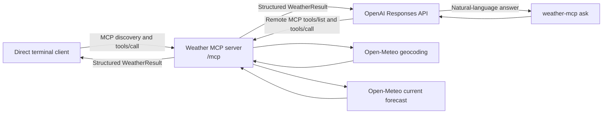

# MCP: Too Afraid to Ask

## Weather MCP learning project

This project is a deliberately small, complete example of the Model Context Protocol (MCP).
It includes:

- a Python MCP server exposing one live `get_weather` tool over Streamable HTTP;
- a direct Python CLI that discovers and calls that tool without an LLM; and
- an optional OpenAI Responses API path where a model decides when and how to call the same
  tool.

The direct path needs no API key. Weather data comes from
[Open-Meteo](https://open-meteo.com/) and is intended for this non-commercial learning sample.

> **New to MCP?** Follow the illustrated, step-by-step tutorial:
> [Build Your First Weather MCP Server in Python](docs/build-your-first-weather-mcp-server.md).

## The mental model

MCP separates a **host/client** from a **server that advertises capabilities**. This sample uses
only the MCP *tools* capability:

1. The client connects to `/mcp` and learns what the server supports.
2. It sends `tools/list` and receives the `get_weather` name, description, and JSON schemas.
3. It sends `tools/call` with a city and unit system.
4. The server calls Open-Meteo and returns a typed, structured result.



The direct CLI makes the protocol boundary visible. The OpenAI path adds model-driven tool
selection, but it does not change the MCP server or its tool schema.

## Requirements and installation

- Python 3.11 or newer
- Node.js only if you want to use MCP Inspector

If you are using the series repository, start at its root and enter this topic first. All
subsequent relative paths and commands assume `topics/mcp` is the current directory:

```bash
cd topics/mcp
python3 -m venv .venv
source .venv/bin/activate
python -m pip install --upgrade pip
python -m pip install -e ".[dev]"
```

If you downloaded this topic by itself, begin in the directory containing its `pyproject.toml`
and omit `cd topics/mcp`.

The project uses standard environment variables. `.env.example` documents them, but the sample
does not silently load `.env` files.

## Run the MCP server

Start the server in one terminal:

```bash
weather-mcp-server
```

It listens on `http://127.0.0.1:8000/mcp`. To choose another interface or port:

```bash
weather-mcp-server --host 0.0.0.0 --port 9000
```

The default loopback binding is intentional. This sample has no authentication or production
rate limiting, so do not expose it permanently without adding those controls.

## Call MCP directly

With the server running, use a second terminal:

```bash
# Perform discovery and show the tool schema.
weather-mcp tools

# Explicitly invoke tools/call and print a readable result.
weather-mcp get "Boston, MA" --units imperial

# Print the structured MCP result as JSON.
weather-mcp get "São Paulo" --json
```

For direct commands, the server URL is chosen in this order:

1. `--server-url`
2. `MCP_SERVER_URL`
3. `http://127.0.0.1:8000/mcp`

The server selects the first geocoding match. Add a region or country to ambiguous names, such as
`Springfield, Illinois` or `Paris, France`.

### Tool contract

```text
get_weather(city: string[2..100], units: "metric" | "imperial" = "metric")
```

The structured result includes the matched location and coordinates, local observation time and
timezone, condition and WMO code, temperature and apparent temperature, humidity, precipitation,
cloud cover, wind speed and direction, day/night state, explicit unit labels, and source
attribution. The tool is annotated as read-only, non-destructive, idempotent, and open-world.

## Let an OpenAI model choose the tool

The optional `ask` command sends a prompt to the Responses API with this MCP server configured as
a remote tool:

```bash
export OPENAI_API_KEY="your-key"
export MCP_SERVER_URL="https://your-public-host.example/mcp"

weather-mcp ask "Should I take a rain jacket in London today?"
```

You can override the model with `--model` or `OPENAI_MODEL`; the configured sample default is
`gpt-5.6`.

The Responses API runs on OpenAI infrastructure, so `localhost` and `127.0.0.1` refer to that
infrastructure—not your laptop. Consequently, `weather-mcp ask` requires a publicly reachable
MCP URL and rejects loopback URLs with a clear error. Deploy the HTTP server or use an appropriate
tunnel. For private environments, see OpenAI's advanced
[Secure MCP Tunnel](https://developers.openai.com/api/docs/guides/secure-mcp-tunnels) guidance.

The OpenAI request deliberately restricts access to `get_weather` and sets
`require_approval="never"` because this one demo tool is read-only. Sensitive or write-capable
tools should retain approval controls. See the official
[MCP and Connectors guide](https://developers.openai.com/api/docs/guides/tools-connectors-mcp).

The prompt and selected location are sent to OpenAI, the configured MCP server, and Open-Meteo as
needed to answer the request. Review each service's data handling before using real sensitive data.

## Inspect the server interactively

Start the server, then launch the official MCP Inspector:

```bash
npx -y @modelcontextprotocol/inspector
```

In Inspector, choose **Streamable HTTP** and connect to:

```text
http://127.0.0.1:8000/mcp
```

You can inspect the generated input/output schemas and invoke `get_weather` without this project's
CLI.

## Tests and quality checks

Normal tests are deterministic and do not call Open-Meteo or OpenAI. If you opened a new shell at
the series repository root, run `cd topics/mcp` before these commands:

```bash
pytest
ruff check .
ruff format --check .
```

An opt-in live smoke test checks only stable response types, never exact changing weather values:

```bash
RUN_LIVE_TESTS=1 pytest -m live -q
```

No automated test makes a paid OpenAI request. Live verification of `weather-mcp ask` requires an
API key and a public MCP endpoint.

## Project layout

In the tree below, `.` means the MCP topic root: `topics/mcp` in the series repository.

```text
.
├── pyproject.toml
├── src/weather_mcp/
│   ├── cli.py               # direct MCP and optional OpenAI clients
│   ├── models.py            # normalized structured output
│   ├── server.py            # MCP server and get_weather tool
│   └── weather_service.py   # Open-Meteo adapter
└── tests/
    ├── test_cli.py
    ├── test_live_weather.py
    ├── test_server.py
    └── test_weather_service.py
```

Resources and prompts are valid MCP capabilities but intentionally omitted. One tool keeps the
example focused on the lifecycle common to most integrations: discovery, schema validation, tool
execution, structured output, and error propagation.

## Troubleshooting

`Connection refused`
: Start `weather-mcp-server`, or pass the correct URL with `--server-url`.

`City not found`
: Add a state, region, or country to make the geocoding query more specific.

`Weather service is temporarily unavailable`
: The provider timed out, returned an error, or changed its response shape. Try again later.

`ask requires a public server URL`
: Direct MCP calls work on localhost, but the remote Responses API cannot reach your loopback
  server. Supply a deployed or tunneled HTTPS `/mcp` URL.

`OPENAI_API_KEY` error
: The key is required only for `weather-mcp ask`; `tools` and `get` remain key-free.

## Data source

Weather and geocoding data: [Open-Meteo.com](https://open-meteo.com/). See its
[forecast documentation](https://open-meteo.com/en/docs),
[geocoding documentation](https://open-meteo.com/en/docs/geocoding-api), and
[usage terms](https://open-meteo.com/en/terms). Current values are model-derived weather data,
not guaranteed live station observations.
