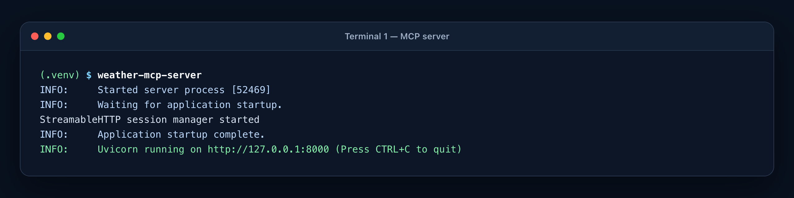
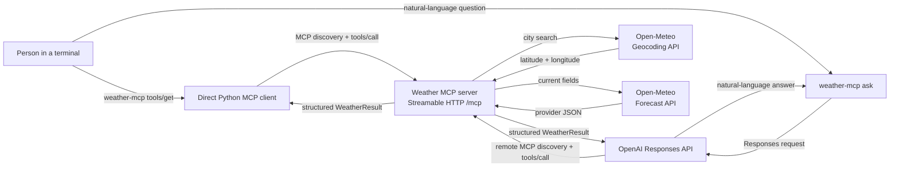
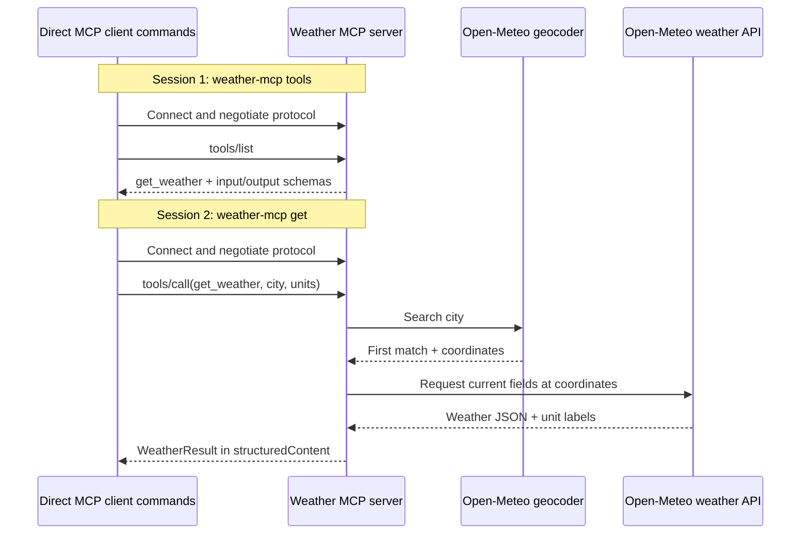
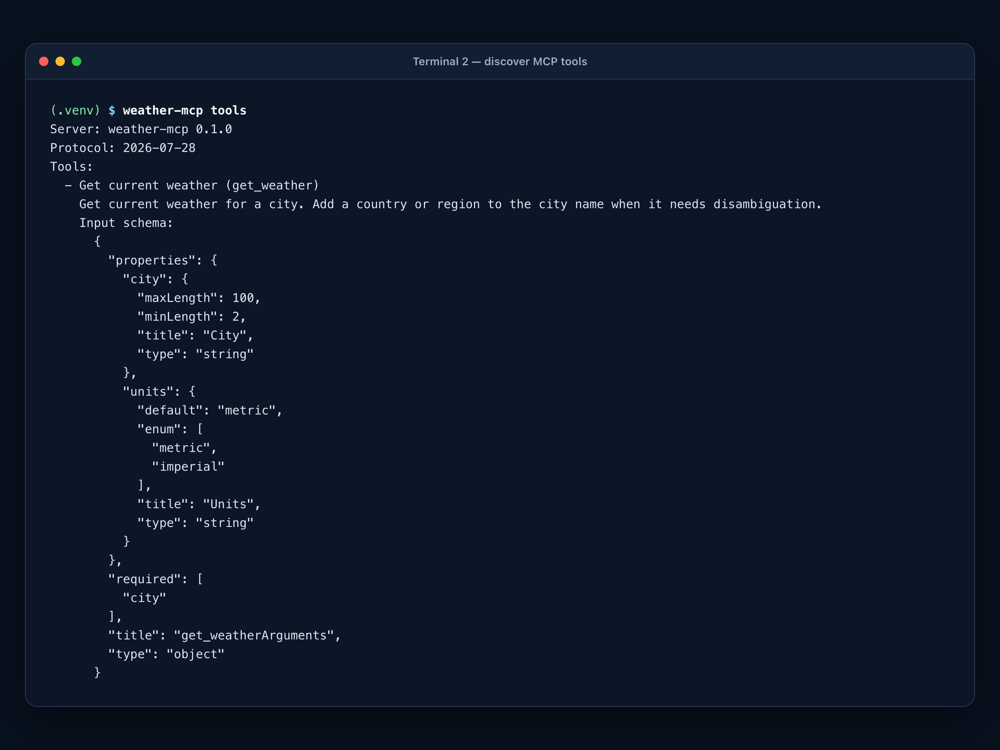
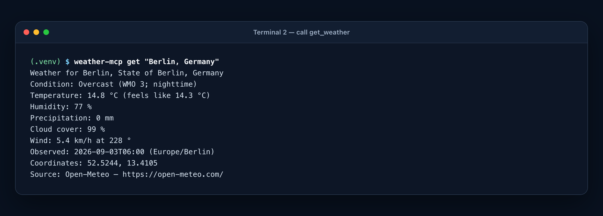
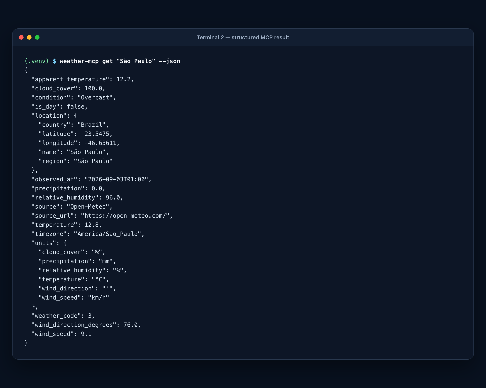
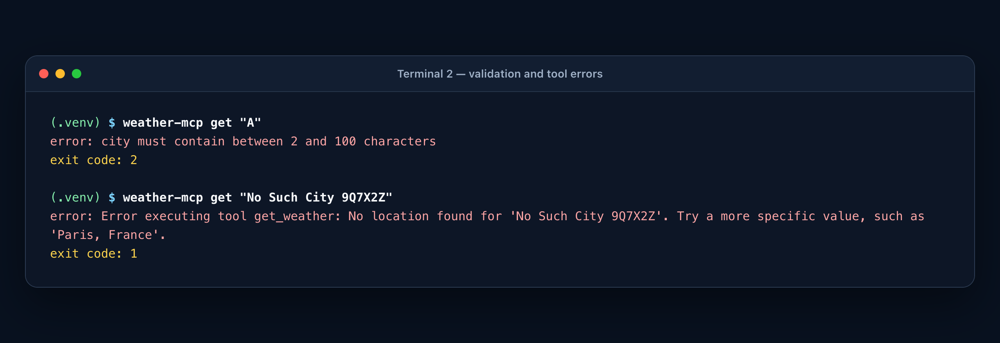
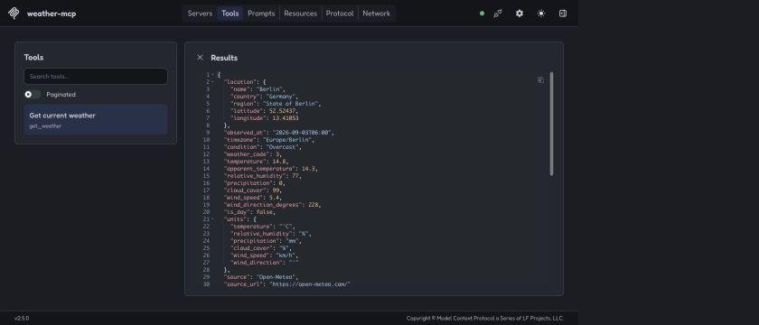
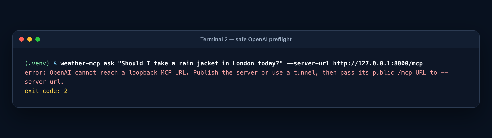
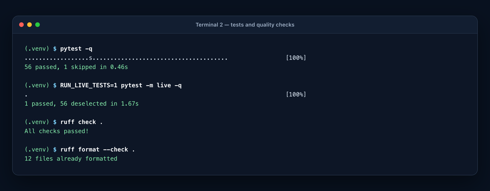

# Build Your First MCP Server in Python

## A weather tool, a direct client, and an optional AI client—built from scratch

Model Context Protocol, usually shortened to **MCP**, gives applications a standard way to discover and call tools. In this tutorial, you will build a complete but deliberately small MCP project:

- a server with one tool named `get_weather`;
- a direct command-line client that discovers and calls that tool;
- a live data adapter for Open-Meteo;
- an optional OpenAI Responses API client that lets a model choose the same tool; and
- offline tests for every important boundary.

Follow along with these finished project files:

- [`pyproject.toml`](../pyproject.toml)
- [`src/weather_mcp/models.py`](../src/weather_mcp/models.py)
- [`src/weather_mcp/weather_service.py`](../src/weather_mcp/weather_service.py)
- [`src/weather_mcp/server.py`](../src/weather_mcp/server.py)
- [`src/weather_mcp/cli.py`](../src/weather_mcp/cli.py)
- [`tests/`](../tests/)

By the end, you will understand discovery, schema generation, structured tool results, and the optional role of an LLM.

> **Version note:** This project pins `mcp==2.1.1`. MCP has changed over time, and many older tutorials use different class names or lifecycle messages. The explanations below match this repository and the MCP `2026-07-28` protocol behavior negotiated by the installed SDK.

---

## 1. See the destination

After installation, the server starts with one command:

```bash
weather-mcp-server
```

It listens at `http://127.0.0.1:8000/mcp`:



**Text transcript**

```text
INFO:     Started server process [...]
INFO:     Waiting for application startup.
StreamableHTTP session manager started
INFO:     Application startup complete.
INFO:     Uvicorn running on http://127.0.0.1:8000 (Press CTRL+C to quit)
```

In a second terminal, the direct client can ask the server what it offers:

```bash
weather-mcp tools
```

Then it can call the discovered tool:

```bash
weather-mcp get "Berlin, Germany"
```

No OpenAI key, LLM, or chat interface is involved in these two commands. That is intentional. The simplest way to understand MCP is to see that it works perfectly well as a protocol between ordinary software components.

### Checkpoint

You are building a server, a client, and a provider adapter. The server is not “the AI,” and the weather API is not “the MCP server.” Each component has one job.

---

## 2. The MCP mental model

Imagine a restaurant. The **host application** is the dining experience, the **MCP client** is the waiter carrying standardized requests, and the **MCP server** is the kitchen publishing a menu. A **tool** is one menu item, while Open-Meteo is the outside supplier providing an ingredient. An **LLM** may help choose from the menu, but it is optional: the server itself is ordinary software, not AI.

Our catalog has exactly one entry:

```text
get_weather(city: string, units: "metric" | "imperial" = "metric")
```

### Tiny glossary

| Term | Plain-English meaning |
|---|---|
| Host | The user-facing application coordinating MCP clients. |
| Client | The component that sends MCP requests. |
| Server | The program advertising and executing capabilities. |
| Tool | A callable operation with named inputs. |
| Schema | Machine-readable rules for inputs or outputs. |
| Transport | How MCP messages travel, here Streamable HTTP. |
| Provider | The downstream service supplying weather data. |
| Structured content | JSON result data intended for software to consume. |

MCP standardizes the messages around that entry. The important operations in this project are:

1. Negotiate the protocol and learn server information.
2. Send `tools/list` to discover available tools and their schemas.
3. Send `tools/call` with a tool name and JSON arguments.
4. Receive content, structured data, or a tool error.

The official [MCP tool specification](https://modelcontextprotocol.io/specification/2026-07-28/server/tools) describes the same `tools/list` and `tools/call` operations. The Python SDK saves us from manually assembling JSON-RPC envelopes, but those protocol messages still exist under the convenience methods.

### The complete architecture



### Discover first, then call in a separate CLI session



The CLI knows only the MCP contract; the provider adapter does not know who initiated the call.

---

## 3. Requirements and project setup

You need:

- Python 3.11 or newer;
- internet access for live weather calls; and
- optionally Node.js if you want to use MCP Inspector later.

Choose one starting point.

**Using this series checkout:** from the series repository root, enter the MCP topic:

```bash
cd topics/mcp
```

**Recreating the project independently:** make and enter a standalone project directory instead:

```bash
mkdir weather-mcp-learning
cd weather-mcp-learning
mkdir -p src/weather_mcp tests docs/images/weather-mcp-tutorial
touch pyproject.toml README.md .env.example .gitignore
touch src/weather_mcp/{__init__,models,weather_service,server,cli}.py
touch tests/{conftest,test_weather_service,test_server,test_cli,test_live_weather}.py
```

On Windows, create the same standalone structure in your editor or with PowerShell. The linked
files are the complete canonical modules. Both paths above leave you at the weather project's
root; all subsequent relative commands assume you stay there.

The project layout is shown below. Here, `.` means the weather project root—`topics/mcp` in the
series checkout, or `weather-mcp-learning` in the standalone workflow:

```text
.
├── .env.example
├── .gitignore
├── pyproject.toml
├── src/
│   └── weather_mcp/
│       ├── __init__.py
│       ├── cli.py
│       ├── models.py
│       ├── server.py
│       └── weather_service.py
└── tests/
    ├── conftest.py
    ├── test_cli.py
    ├── test_live_weather.py
    ├── test_server.py
    └── test_weather_service.py
```

Create a virtual environment from the project root and install the package in editable mode:

```bash
python3 -m venv .venv
source .venv/bin/activate
python -m pip install --upgrade pip
python -m pip install -e ".[dev]"
```

On Windows PowerShell, activation is usually:

```powershell
.venv\Scripts\Activate.ps1
```

The `-e` means edits under `src/` are immediately visible to the installed console commands. The `[dev]` extra includes pytest and Ruff.

### Package configuration

The central parts of [`pyproject.toml`](../pyproject.toml) are:

```toml
[build-system]
requires = ["hatchling==1.32.0"]
build-backend = "hatchling.build"

[project]
name = "weather-mcp-learning"
version = "0.1.0"
description = "A small, end-to-end weather MCP server and client learning project"
readme = "README.md"
requires-python = ">=3.11"
dependencies = [
  "httpx==0.28.1",
  "mcp==2.1.1",
  "openai==3.7.0",
  "pydantic==2.13.5",
]

[project.optional-dependencies]
dev = [
  "pytest==9.1.1",
  "pytest-asyncio==1.4.0",
  "ruff==0.16.5",
]

[project.scripts]
weather-mcp = "weather_mcp.cli:main"
weather-mcp-server = "weather_mcp.server:main"

[tool.hatch.build.targets.wheel]
packages = ["src/weather_mcp"]
```

There are four runtime libraries:

| Package | Job |
|---|---|
| `mcp` | Implements the server, client, protocol messages, and HTTP transport. |
| `httpx` | Calls the Open-Meteo APIs asynchronously. |
| `pydantic` | Validates provider data and generates tool schemas. |
| `openai` | Supports the optional model-mediated client. |

The `[project.scripts]` entries create the two commands used throughout this tutorial. Each value is `Python module:function`.

The package version is also exposed in [`src/weather_mcp/__init__.py`](../src/weather_mcp/__init__.py):

```python
"""Weather MCP learning project."""

__version__ = "0.1.0"
```

### Environment variables

The sample documents its settings in [`.env.example`](../.env.example):

```dotenv
# Direct MCP commands default to this local URL when unset.
MCP_SERVER_URL=http://127.0.0.1:8000/mcp

# Required only by `weather-mcp ask`.
OPENAI_API_KEY=
OPENAI_MODEL=gpt-5.6
```

The application does **not** silently load `.env` files. Either export values in your shell or pass command-line options. This keeps configuration behavior explicit.

### Checkpoint

Verify the two entry points:

```bash
weather-mcp --help
weather-mcp-server --help
```

At this stage the commands are installed. Next we define exactly what the weather tool returns.

---

## 4. Design the result before the server

A beginner’s first impulse may be to make the tool return a sentence such as `"Berlin is 21°C"`. A sentence is easy for a human to read but awkward for software to use reliably. Which part is the temperature? Is the unit always Celsius? Where is the observation time?

Instead, this project defines a structured result in [`models.py`](../src/weather_mcp/models.py):

```python
from typing import Literal

from pydantic import BaseModel, ConfigDict, Field

Units = Literal["metric", "imperial"]


class WeatherLocation(BaseModel):
    """The first location matched by Open-Meteo's geocoder."""

    model_config = ConfigDict(extra="forbid", allow_inf_nan=False)

    name: str
    country: str
    region: str | None = None
    latitude: float = Field(ge=-90, le=90)
    longitude: float = Field(ge=-180, le=180)


class WeatherUnits(BaseModel):
    """Unit labels supplied by Open-Meteo for each numeric measurement."""

    model_config = ConfigDict(extra="forbid")

    temperature: str
    relative_humidity: str
    precipitation: str
    cloud_cover: str
    wind_speed: str
    wind_direction: str


class WeatherResult(BaseModel):
    """Provider-independent weather data exposed as MCP structured output."""

    model_config = ConfigDict(extra="forbid", allow_inf_nan=False)

    location: WeatherLocation
    observed_at: str
    timezone: str
    condition: str
    weather_code: int
    temperature: float
    apparent_temperature: float
    relative_humidity: float = Field(ge=0, le=100)
    precipitation: float = Field(ge=0)
    cloud_cover: float = Field(ge=0, le=100)
    wind_speed: float = Field(ge=0)
    wind_direction_degrees: float = Field(ge=0, le=360)
    is_day: bool
    units: WeatherUnits
    source: str = "Open-Meteo"
    source_url: str = "https://open-meteo.com/"
```

Several small choices matter:

- `Literal` limits `units` to two exact strings. That later becomes an enum in the MCP input schema.
- `Field(ge=..., le=...)` places meaningful bounds on numbers.
- `extra="forbid"` rejects accidental fields in our public contract.
- `allow_inf_nan=False` rejects floating-point values that JSON cannot represent portably.
- The provider’s unit labels travel with the measurements, so a client never has to guess whether `21` means Celsius or Fahrenheit.
- Attribution is part of every result rather than a footnote that clients might lose.

This model is **provider-independent**. If you later replace Open-Meteo, MCP clients can keep consuming `WeatherResult` as long as the new adapter produces the same shape.

### How this becomes an MCP schema

When the SDK sees that the tool returns `WeatherResult`, it generates an `outputSchema`. The bounds above become JSON Schema properties such as:

```json
{
  "relative_humidity": {
    "minimum": 0,
    "maximum": 100,
    "type": "number"
  },
  "is_day": {
    "type": "boolean"
  }
}
```

The schema lets a client inspect the result shape *before calling the tool*. It also lets the SDK validate actual results. This is one of MCP’s most useful ideas: the server advertises a machine-readable contract, not only a name and prose description.

---

## 5. Put the weather provider behind a small interface

The MCP tool should not contain URLs, HTTP calls, provider-specific field names, validation, formatting, and error handling all in one function. Those responsibilities belong in a service adapter.

Start with two domain errors and one protocol in [`weather_service.py`](../src/weather_mcp/weather_service.py):

```python
class LocationNotFoundError(ValueError):
    """Raised when the geocoder cannot match a requested city."""


class WeatherProviderError(RuntimeError):
    """Raised with a safe message when Open-Meteo cannot provide valid data."""


class WeatherService(Protocol):
    """Small interface consumed by the MCP tool, allowing test substitutes."""

    async def get_weather(self, city: str, units: Units) -> WeatherResult:
        """Return current weather for a city."""
```

A `Protocol` says, “anything with this method has the shape of a weather service.” `OpenMeteoWeatherService` will satisfy it, but so will a tiny fake object in a test. That is dependency injection without a framework.

The error types separate two user experiences:

- A missing city is actionable: ask for a more specific location.
- A failed provider is operational: show a safe retry message, not a raw network exception.

### The external endpoints and fields

The adapter uses two public endpoints:

```python
GEOCODING_URL = "https://geocoding-api.open-meteo.com/v1/search"
FORECAST_URL = "https://api.open-meteo.com/v1/forecast"
OPEN_METEO_URL = "https://open-meteo.com/"
DEFAULT_TIMEOUT_SECONDS = 10.0

_CURRENT_FIELDS = (
    "temperature_2m",
    "relative_humidity_2m",
    "apparent_temperature",
    "is_day",
    "precipitation",
    "weather_code",
    "cloud_cover",
    "wind_speed_10m",
    "wind_direction_10m",
)
```

Why two requests? The forecast API expects coordinates, while a person naturally enters a city. The [Open-Meteo geocoding documentation](https://open-meteo.com/en/docs/geocoding-api) describes searching by location name and narrowing ambiguous searches with a country or administrative area. The adapter turns the first result into latitude and longitude, then sends those coordinates to the [forecast endpoint](https://open-meteo.com/en/docs).

```text
"Boston, MA"
      │
      ▼
Geocoding API ──► latitude 42.35843, longitude -71.05977
                                      │
                                      ▼
                               Forecast API
                                      │
                                      ▼
                                WeatherResult
```

The forecast endpoint’s name can be confusing here. We request its `current` fields, not a seven-day display. Open-Meteo documents current conditions as values based on weather-model data; they should not be described as a direct reading from a live station.

---

## 6. Validate data at the provider boundary

External JSON is untrusted input. A service can time out, add fields, omit fields, or return a string where you expected a number. The project validates provider responses with private Pydantic models.

Here is the geocoding shape:

```python
class _GeocodingPlace(BaseModel):
    model_config = ConfigDict(extra="ignore", allow_inf_nan=False)

    name: str = Field(min_length=1)
    country: str = Field(min_length=1)
    admin1: str | None = None
    latitude: float = Field(ge=-90, le=90)
    longitude: float = Field(ge=-180, le=180)


class _GeocodingResponse(BaseModel):
    model_config = ConfigDict(extra="ignore")

    results: list[_GeocodingPlace] = Field(default_factory=list)
```

And these models capture only the forecast fields we use:

```python
class _CurrentWeather(BaseModel):
    model_config = ConfigDict(extra="ignore", allow_inf_nan=False)

    time: str = Field(min_length=1)
    temperature_2m: float
    relative_humidity_2m: float = Field(ge=0, le=100)
    apparent_temperature: float
    is_day: Literal[0, 1]
    precipitation: float = Field(ge=0)
    weather_code: int
    cloud_cover: float = Field(ge=0, le=100)
    wind_speed_10m: float = Field(ge=0)
    wind_direction_10m: float = Field(ge=0, le=360)


class _CurrentUnits(BaseModel):
    model_config = ConfigDict(extra="ignore")

    temperature_2m: str = Field(min_length=1)
    relative_humidity_2m: str = Field(min_length=1)
    apparent_temperature: str = Field(min_length=1)
    precipitation: str = Field(min_length=1)
    cloud_cover: str = Field(min_length=1)
    wind_speed_10m: str = Field(min_length=1)
    wind_direction_10m: str = Field(min_length=1)


class _ForecastResponse(BaseModel):
    model_config = ConfigDict(extra="ignore")

    timezone: str = Field(min_length=1)
    current: _CurrentWeather
    current_units: _CurrentUnits
```

Why do these private models use `extra="ignore"` while the public result uses `extra="forbid"`?

- A provider is allowed to add fields without breaking us. We ignore data we did not request.
- Our MCP output should change only when we intentionally change it. We forbid accidental additions.

That difference creates a clean boundary: flexible on the outside, strict on the inside.

### Translate WMO codes

Open-Meteo returns a numeric weather code. The adapter maps known codes to friendly text:

```python
_WMO_DESCRIPTIONS: dict[int, str] = {
    0: "Clear sky",
    1: "Mainly clear",
    2: "Partly cloudy",
    3: "Overcast",
    45: "Fog",
    61: "Slight rain",
    75: "Heavy snowfall",
    95: "Thunderstorm",
    99: "Thunderstorm with heavy hail",
}


def describe_wmo_code(code: int) -> str:
    """Return a readable WMO interpretation, including a useful fallback."""

    return _WMO_DESCRIPTIONS.get(code, f"Unknown weather condition (WMO code {code})")
```

The [complete source mapping](../src/weather_mcp/weather_service.py) includes every code used by the project. The fallback is important: a new or unexpected code should remain visible instead of crashing the whole tool.

---

## 7. Implement the live weather service

Now we can write `OpenMeteoWeatherService`. Its constructor accepts an optional `httpx.AsyncClient`:

```python
class OpenMeteoWeatherService:
    """Fetch current conditions from Open-Meteo's unauthenticated APIs.

    An injected client remains owned by the caller. Without one, a short-lived
    client is created and shared by the geocoding and forecast requests.
    """

    def __init__(
        self,
        client: httpx.AsyncClient | None = None,
        *,
        timeout: float = DEFAULT_TIMEOUT_SECONDS,
    ) -> None:
        if timeout <= 0:
            raise ValueError("timeout must be greater than zero")
        self._client = client
        self._timeout = timeout
```

The optional client solves two problems:

1. Tests can inject an HTTP client backed by fake responses.
2. A larger application could manage and reuse a client itself.

Ownership remains clear. If the caller supplies a client, the service does not close it. If no client is supplied, the service creates one and closes it with `async with`:

```python
async def get_weather(self, city: str, units: Units = "metric") -> WeatherResult:
    """Geocode ``city``, then fetch and normalize its current conditions."""

    normalized_city = city.strip()
    if not 2 <= len(normalized_city) <= 100:
        raise ValueError("city must contain between 2 and 100 characters")
    if units not in ("metric", "imperial"):
        raise ValueError("units must be either 'metric' or 'imperial'")

    if self._client is not None:
        return await self._get_weather(self._client, normalized_city, units)

    async with httpx.AsyncClient(
        timeout=self._timeout,
        headers={
            "Accept": "application/json",
            "User-Agent": "weather-mcp-learning-project/0.1.0",
        },
    ) as client:
        return await self._get_weather(client, normalized_city, units)
```

Input is checked before any network request. Even though the MCP layer will also validate these values, the service is a reusable boundary and protects itself.

### Request 1: geocode the city

The internal `_get_weather` method starts with the city search:

```python
geocoding_payload = await self._get_json(
    client,
    GEOCODING_URL,
    params={
        "name": city,
        "count": 1,
        "language": "en",
        "format": "json",
    },
)
try:
    geocoding = _GeocodingResponse.model_validate(geocoding_payload)
except ValidationError as exc:
    raise WeatherProviderError(_SAFE_PROVIDER_MESSAGE) from exc

if not geocoding.results:
    raise LocationNotFoundError(
        f"No location found for {city!r}. Try a more specific value, such as 'Paris, France'."
    )
place = geocoding.results[0]
```

`count=1` expresses this tutorial’s simplicity tradeoff: take the provider’s first ranked match. That makes a command convenient, but an ambiguous city can resolve somewhere unexpected. A user can disambiguate with `Paris, France`, `Springfield, Illinois`, or `Boston, MA`.

The geocoder supports Unicode, so a city such as `München` or `São Paulo` remains intact. `httpx` handles URL encoding for us.

### Request 2: fetch current conditions

The second request uses the selected coordinates:

```python
forecast_params: dict[str, str | float] = {
    "latitude": place.latitude,
    "longitude": place.longitude,
    "current": ",".join(_CURRENT_FIELDS),
    "timezone": "auto",
}
if units == "imperial":
    forecast_params.update(
        temperature_unit="fahrenheit",
        wind_speed_unit="mph",
        precipitation_unit="inch",
    )
else:
    forecast_params.update(
        temperature_unit="celsius",
        wind_speed_unit="kmh",
        precipitation_unit="mm",
    )

forecast_payload = await self._get_json(
    client,
    FORECAST_URL,
    params=forecast_params,
)
try:
    forecast = _ForecastResponse.model_validate(forecast_payload)
    return self._normalize(place, forecast)
except ValidationError as exc:
    raise WeatherProviderError(_SAFE_PROVIDER_MESSAGE) from exc
```

`timezone="auto"` asks the provider to return local time for the selected coordinates. The output also carries the named timezone, so a client can present the observation without assuming its own machine’s timezone.

Metric and imperial choices are converted into the provider’s parameter vocabulary. Notice that the result still takes actual unit labels from `current_units`. That avoids coupling display code to assumptions about labels.

### Make HTTP and JSON failures safe

Every external request passes through one helper:

```python
async def _get_json(
    self,
    client: httpx.AsyncClient,
    url: str,
    *,
    params: Mapping[str, str | float | int],
) -> Any:
    try:
        response = await client.get(url, params=params, timeout=self._timeout)
        response.raise_for_status()
        payload = response.json()
    except (httpx.HTTPError, ValueError) as exc:
        raise WeatherProviderError(_SAFE_PROVIDER_MESSAGE) from exc

    if not isinstance(payload, Mapping):
        raise WeatherProviderError(_SAFE_PROVIDER_MESSAGE)
    return cast(Mapping[str, Any], payload)
```

This catches connection errors, timeouts, unsuccessful HTTP statuses, and invalid JSON. It deliberately does not send raw upstream content back to an MCP caller. Provider responses can contain internal details that are useful in private logs but inappropriate in a model-visible tool result.

The safe provider message is:

```python
_SAFE_PROVIDER_MESSAGE = (
    "The weather provider is temporarily unavailable or returned invalid data. "
    "Please try again later."
)
```

### Normalize provider fields into our contract

The last service step translates provider naming into `WeatherResult`:

```python
@staticmethod
def _normalize(
    place: _GeocodingPlace,
    forecast: _ForecastResponse,
) -> WeatherResult:
    current = forecast.current
    unit_data = forecast.current_units
    return WeatherResult(
        location=WeatherLocation(
            name=place.name,
            country=place.country,
            region=place.admin1,
            latitude=place.latitude,
            longitude=place.longitude,
        ),
        observed_at=current.time,
        timezone=forecast.timezone,
        condition=describe_wmo_code(current.weather_code),
        weather_code=current.weather_code,
        temperature=current.temperature_2m,
        apparent_temperature=current.apparent_temperature,
        relative_humidity=current.relative_humidity_2m,
        precipitation=current.precipitation,
        cloud_cover=current.cloud_cover,
        wind_speed=current.wind_speed_10m,
        wind_direction_degrees=current.wind_direction_10m,
        is_day=bool(current.is_day),
        units=WeatherUnits(
            temperature=unit_data.temperature_2m,
            relative_humidity=unit_data.relative_humidity_2m,
            precipitation=unit_data.precipitation,
            cloud_cover=unit_data.cloud_cover,
            wind_speed=unit_data.wind_speed_10m,
            wind_direction=unit_data.wind_direction_10m,
        ),
        source="Open-Meteo",
        source_url=OPEN_METEO_URL,
    )
```

The rest of the application never needs names such as `temperature_2m` or `wind_speed_10m`. Those are provider implementation details. Normalization also turns `is_day` from the provider’s `0` or `1` into a real boolean.

Open-Meteo’s current-weather documentation explains the available values and notes that current conditions are based on 15-minute weather-model data. Review its [usage terms](https://open-meteo.com/en/terms) before using the service beyond this learning project.

### Checkpoint

We now have a tested Python operation with a simple shape:

```python
result = await OpenMeteoWeatherService().get_weather("Berlin", "metric")
```

---

## 8. Create the MCP server

The server lives in [`server.py`](../src/weather_mcp/server.py). First, constrain the city argument at the MCP boundary:

```python
City = Annotated[
    str,
    StringConstraints(strip_whitespace=True, min_length=2, max_length=100),
]
```

The SDK reads this annotation when it creates the tool’s input schema. A client will discover that `city` is a string between 2 and 100 characters. Whitespace is stripped before the tool function runs.

### Use a server factory

Rather than constructing everything only at module import time, the project uses a factory:

```python
def create_server(weather_service: WeatherService | None = None) -> MCPServer:
    """Build a weather MCP server, optionally using an injected service."""
    service = weather_service if weather_service is not None else OpenMeteoWeatherService()
    server = MCPServer(
        name="weather-mcp",
        title="Weather MCP Server",
        description="A learning server that returns current weather from Open-Meteo.",
        instructions="Call get_weather with a city name to retrieve current weather.",
        version=__version__,
    )

    @server.tool(
        name="get_weather",
        title="Get current weather",
        description=(
            "Get current weather for a city. Add a country or region to the city name "
            "when it needs disambiguation."
        ),
        annotations=ToolAnnotations(
            read_only_hint=True,
            destructive_hint=False,
            idempotent_hint=True,
            open_world_hint=True,
        ),
        structured_output=True,
    )
    async def get_weather(city: City, units: Units = "metric") -> WeatherResult:
        try:
            return await service.get_weather(city, units)
        except LocationNotFoundError as exc:
            raise ToolError(str(exc)) from exc
        except WeatherProviderError as exc:
            raise ToolError(
                "Weather service is temporarily unavailable. Please try again later."
            ) from exc

    return server
```

The metadata serves different readers:

- `name` is the programmatic server name.
- `title` is suitable for a user interface.
- `description` summarizes the server.
- `instructions` give a client or model high-level usage guidance.
- `version` helps clients and logs identify the implementation they reached.

The optional `weather_service` is the seam used by contract tests. Production calls get `OpenMeteoWeatherService`; tests inject a deterministic fake.

### Register one tool

The decorator inside the factory registers an ordinary async function. The complete block above is copyable and returns the configured server; it is the heart of the MCP layer.

The function signature becomes the machine-readable input contract:

```text
city: required string, length 2–100
units: optional "metric" or "imperial", default "metric"
```

The `-> WeatherResult` annotation and `structured_output=True` create the output contract. MCP clients can see the schema during discovery, and the SDK validates successful results against it. The official Python SDK also returns a serialized text block for compatibility; the [MCP structured-content specification](https://modelcontextprotocol.io/specification/2026-07-28/server/tools#structured-content) explains why structured content is accompanied by text.

> **MCP 2.x syntax:** `tool()` is a decorator factory. Write `@server.tool(...)` or `@server.tool()`, including parentheses. Older snippets or an accidental `@server.tool` will not register the function correctly.

### Understand the annotations

The four `ToolAnnotations` values are hints about behavior:

| Hint | Value | Meaning here |
|---|---:|---|
| `read_only_hint` | `True` | The tool reads weather; it does not mutate application state. |
| `destructive_hint` | `False` | It does not delete or overwrite anything. |
| `idempotent_hint` | `True` | Repeating identical calls adds no state-changing effect. This is redundant for a read-only tool and does not promise identical live values. |
| `open_world_hint` | `True` | The tool talks to systems outside the MCP server process. |

These annotations are useful to clients and models, but they are **not permissions**. The MCP specification tells clients to treat annotations as untrusted unless the server itself is trusted. Authentication, authorization, approvals, and network controls still need real enforcement.

### Translate expected failures into tool errors

The tool catches two service errors and raises `ToolError`:

- A missing location keeps its useful, corrective message.
- A provider failure becomes a shorter safe message.

A tool error is different from a crashed connection. The MCP call normally returns a result with `isError: true`, text describing the failure, and no `structuredContent`. A model can read that text and decide whether to retry with a better city. The official Python SDK’s [error-handling guide](https://github.com/modelcontextprotocol/python-sdk/blob/main/docs/servers/handling-errors.md) describes this distinction.

Do not return an error sentence as a successful value. A returned string looks like success. Raising a tool error sets the signal clients need.

---

## 9. Run the server over Streamable HTTP

After creating the factory, the module builds the default server:

```python
mcp = create_server()
```

The command parser defaults to loopback port 8000, and `main()` runs the transport:

```python
def main(argv: Sequence[str] | None = None) -> None:
    """Run the module-global server on the configured HTTP address."""
    args = _parser().parse_args(argv)
    try:
        mcp.run(
            "streamable-http",
            host=args.host,
            port=args.port,
            streamable_http_path="/mcp",
            json_response=True,
            stateless_http=True,
        )
    except KeyboardInterrupt:
        # MCP/AnyIO may re-raise Ctrl+C after Uvicorn has shut down cleanly.
        pass
```

Each option has a purpose:

- `"streamable-http"` selects MCP’s HTTP transport.
- `streamable_http_path="/mcp"` creates the single MCP endpoint.
- `json_response=True` uses JSON HTTP responses instead of returning a Server-Sent Events stream for each response.
- `stateless_http=True` means the server does not keep protocol session state between requests.
- `127.0.0.1` is reachable only from the local machine by default.

This is still MCP over JSON-RPC; it is not a REST route where `GET /mcp/weather?city=Berlin` returns a weather object. The MCP client sends methods such as `tools/list` and `tools/call` in request envelopes.

The `2026-07-28` MCP revision removed the old protocol-level session and carries protocol/client information on each modern request. The official [MCP 2026-07-28 release explanation](https://blog.modelcontextprotocol.io/posts/2026-07-28/) provides the broader rationale. Application state is still possible, but it should be explicit rather than hidden in a transport session. This weather server needs no state at all.

### Start it

Activate the virtual environment and run:

```bash
source .venv/bin/activate
weather-mcp-server
```

To select another address or port:

```bash
weather-mcp-server --host 0.0.0.0 --port 9000
```

`0.0.0.0` means “listen on all interfaces.” It does **not** add TLS, authentication, rate limiting, or safe internet hosting. Keep the loopback default while learning.

### Checkpoint

Leave the server running in terminal 1. Open terminal 2, activate the same virtual environment, and continue there:

```bash
source .venv/bin/activate
```

---

## 10. Build a direct MCP client

The server is useful only if a client can understand it. Before involving a model, we will make the protocol boundary visible with two commands:

- `weather-mcp tools` discovers the catalog.
- `weather-mcp get ...` invokes `get_weather` directly.

The constants at the top of [`cli.py`](../src/weather_mcp/cli.py) give both commands a shared endpoint:

```python
DEFAULT_SERVER_URL = "http://127.0.0.1:8000/mcp"
DEFAULT_MODEL = "gpt-5.6"
WEATHER_TOOL = "get_weather"
SERVER_LABEL = "weather"
SERVER_DESCRIPTION = "Read-only current weather data for cities, sourced from Open-Meteo."
```

### Discover the server’s tools

The discovery function is small:

```python
async def discover_tools(server_url: str, client_factory: Callable[[str], Any] = Client) -> str:
    """Connect to an MCP server and return a human-readable discovery report."""

    async with client_factory(server_url) as client:
        result = await client.list_tools()
        server_info = _field(client, "server_info")
        protocol_version = _field(client, "protocol_version")

    server_name = _field(server_info, "name", "unknown")
    server_version = _field(server_info, "version")
    heading = f"Server: {server_name}"
    if server_version:
        heading += f" {server_version}"
    lines = [heading]
    if protocol_version:
        lines.append(f"Protocol: {protocol_version}")
    lines.append("Tools:")

    tools = _field(result, "tools", []) or []
    if not tools:
        lines.append("  (none)")
    for tool in tools:
        name = _field(tool, "name", "unknown")
        title = _field(tool, "title")
        lines.append(f"  - {title} ({name})" if title and title != name else f"  - {name}")
        description = _field(tool, "description")
        if description:
            lines.append(f"    {description}")
        lines.append("    Input schema:")
        schema = _field(tool, "input_schema", _field(tool, "inputSchema", {}))
        lines.extend(_format_schema(schema))
    return "\n".join(lines)
```

The most important lines are these:

```python
async with Client(server_url) as client:
    result = await client.list_tools()
```

Entering the async context connects and negotiates. In `mcp==2.1.1`, the client’s default `mode="auto"` probes modern `server/discover`, then falls back to the legacy `initialize` lifecycle if it meets an older server. By the time the body runs, properties such as `protocol_version` are populated.

`list_tools()` sends the MCP `tools/list` operation. The returned entries include the name, title, description, input schema, output schema, annotations, and other protocol metadata. Our formatter prints the beginner-relevant input side.

Run it:

```bash
weather-mcp tools
```



**Text transcript**

```text
Server: weather-mcp 0.1.0
Protocol: 2026-07-28
Tools:
  - Get current weather (get_weather)
    Get current weather for a city. Add a country or region to the city name when it needs disambiguation.
    Input schema:
      {
        "properties": {
          "city": {
            "maxLength": 100,
            "minLength": 2,
            "title": "City",
            "type": "string"
          },
          "units": {
            "default": "metric",
            "enum": ["metric", "imperial"],
            "title": "Units",
            "type": "string"
          }
        },
        "required": ["city"],
        "title": "get_weatherArguments",
        "type": "object"
      }
```

We did not hand-write that JSON Schema. It came from `city: City` and `units: Units = "metric"` on the server function.

### Call the tool

Direct invocation is just as focused:

```python
async def call_weather(
    server_url: str,
    city: str,
    units: str,
    client_factory: Callable[[str], Any] = Client,
) -> dict[str, Any]:
    """Call ``get_weather`` directly and return its structured result."""

    normalized_city = city.strip()
    if not 2 <= len(normalized_city) <= 100:
        raise CLIError("city must contain between 2 and 100 characters", exit_code=2)

    async with client_factory(server_url) as client:
        result = await client.call_tool(
            WEATHER_TOOL,
            {"city": normalized_city, "units": units},
        )
    return structured_tool_result(result)
```

The dictionary is serialized by the SDK into the `arguments` object of `tools/call`. The server validates it, runs the decorated function, validates the returned model, and sends a tool result.

The `get` command calls the already-known tool name directly; it does not run `tools/list` before every lookup.

Try metric output:

```bash
weather-mcp get "Berlin, Germany"
```



**Example transcript—your live weather will differ**

```text
Weather for Berlin, State of Berlin, Germany
Condition: Overcast (WMO 3; nighttime)
Temperature: 14.8 °C (feels like 14.3 °C)
Humidity: 77 %
Precipitation: 0 mm
Cloud cover: 99 %
Wind: 5.4 km/h at 228 °
Observed: 2026-09-03T06:00 (Europe/Berlin)
Coordinates: 52.5244, 13.4105
Source: Open-Meteo — https://open-meteo.com/
```

Try imperial output:

```bash
weather-mcp get "Boston, MA" --units imperial
```

### Prefer structured content in application code

The SDK’s call result can contain:

- `content`: blocks meant for a model or human-facing presentation;
- `structured_content`: JSON data matching the advertised output schema; and
- `is_error`: whether tool execution failed.

The client extracts those safely:

```python
def structured_tool_result(result: Any) -> dict[str, Any]:
    """Extract a successful structured tool result from an MCP SDK value."""

    is_error = bool(_field(result, "is_error", _field(result, "isError", False)))
    if is_error:
        detail = _result_text(result) or "the MCP server reported a tool error"
        raise CLIError(detail)

    structured = _field(
        result,
        "structured_content",
        _field(result, "structuredContent"),
    )
    if structured is None:
        text = _result_text(result)
        try:
            structured = json.loads(text)
        except (json.JSONDecodeError, TypeError):
            structured = None

    converted = _jsonable(structured)
    if not isinstance(converted, dict):
        raise CLIError("the MCP server did not return structured weather data")
    return converted
```

Application code should prefer `structured_content`: there is no sentence parsing and no guessing. The text fallback makes the client friendlier to compatible servers that provide serialized JSON only.

The MCP specification intentionally allows both representations. `structuredContent` is the machine-readable value, while a `TextContent` block keeps older or model-oriented consumers useful. This MCP feature is unrelated to the similarly named LLM feature “Structured Outputs”; here the **tool server** produced the structured value.

### See the exact JSON result

Use `--json` to skip the human formatter:

```bash
weather-mcp get "São Paulo" --json
```



**Example transcript—values and timestamps will differ**

```json
{
  "apparent_temperature": 12.2,
  "cloud_cover": 100.0,
  "condition": "Overcast",
  "is_day": false,
  "location": {
    "country": "Brazil",
    "latitude": -23.5475,
    "longitude": -46.63611,
    "name": "São Paulo",
    "region": "São Paulo"
  },
  "observed_at": "2026-09-03T01:00",
  "precipitation": 0.0,
  "relative_humidity": 96.0,
  "source": "Open-Meteo",
  "source_url": "https://open-meteo.com/",
  "temperature": 12.8,
  "timezone": "America/Sao_Paulo",
  "units": {
    "cloud_cover": "%",
    "precipitation": "mm",
    "relative_humidity": "%",
    "temperature": "°C",
    "wind_direction": "°",
    "wind_speed": "km/h"
  },
  "weather_code": 3,
  "wind_direction_degrees": 76.0,
  "wind_speed": 9.1
}
```

The same object works for a GUI, automation, or model client. Unicode survives the entire path.

### See a tool error

The screenshot demonstrates two different failure boundaries:

```bash
weather-mcp get "A"
weather-mcp get "No Such City 9Q7X2Z"
```



**Text transcript**

```text
error: city must contain between 2 and 100 characters
exit code: 2

error: Error executing tool get_weather: No location found for 'No Such City 9Q7X2Z'. Try a more specific value, such as 'Paris, France'.
exit code: 1
```

`"A"` fails in the CLI before a connection is made. The second input passes local validation, reaches the server, and becomes a `ToolError`. At the protocol level that is normally a completed `tools/call` response with `isError: true`, not necessarily an HTTP error status. Avoid `Atlantis` here because it can resolve to a real city in South Africa.

### How command options are wired

The CLI defines three subcommands with `argparse`:

```text
weather-mcp tools [--server-url URL]
weather-mcp get CITY [--units metric|imperial] [--json] [--server-url URL]
weather-mcp ask PROMPT --server-url PUBLIC_URL [--model MODEL]
```

For direct commands, the server URL is resolved in this order:

1. `--server-url`
2. `MCP_SERVER_URL`
3. `http://127.0.0.1:8000/mcp`

`asyncio.run(...)` bridges the synchronous console entry point to the async MCP functions. The outer `main()` catches expected `CLIError` values, keyboard interruption, and unexpected failures so users see a clean one-line message rather than a stack trace.

### Checkpoint

You have now exercised the full useful path without an LLM:

```text
terminal client → MCP protocol → weather server → Open-Meteo → structured MCP result
```

If your goal is an ordinary integration or automation, you can stop here. The next sections inspect the wire, add an optional model, and prove the behavior with tests.

---

## 11. Peek under the SDK: what travels over `/mcp`?

The Python SDK should normally construct MCP messages for you. Still, seeing the shapes once makes the abstractions concrete.

MCP uses JSON-RPC-style requests. A simplified tool-list request looks like:

```json
{
  "jsonrpc": "2.0",
  "id": 2,
  "method": "tools/list",
  "params": {}
}
```

The server returns tool definitions. Abbreviated for this project:

```json
{
  "jsonrpc": "2.0",
  "id": 2,
  "result": {
    "resultType": "complete",
    "tools": [
      {
        "name": "get_weather",
        "title": "Get current weather",
        "inputSchema": {
          "type": "object",
          "properties": {
            "city": {"type": "string", "minLength": 2, "maxLength": 100},
            "units": {
              "type": "string",
              "enum": ["metric", "imperial"],
              "default": "metric"
            }
          },
          "required": ["city"]
        },
        "outputSchema": {"title": "WeatherResult", "type": "object"}
      }
    ]
  }
}
```

A tool call carries the selected name and arguments:

```json
{
  "jsonrpc": "2.0",
  "id": 3,
  "method": "tools/call",
  "params": {
    "name": "get_weather",
    "arguments": {
      "city": "Boston, MA",
      "units": "imperial"
    }
  }
}
```

A successful result contains both representations:

```json
{
  "jsonrpc": "2.0",
  "id": 3,
  "result": {
    "resultType": "complete",
    "content": [
      {"type": "text", "text": "{ ... serialized weather JSON ... }"}
    ],
    "isError": false,
    "structuredContent": {
      "location": {"name": "Boston", "country": "United States"},
      "temperature": 61.9,
      "condition": "Partly cloudy",
      "source": "Open-Meteo"
    }
  }
}
```

### The current MCP 2.x lifecycle detail

If you have read older MCP material, you may expect every connection to send `initialize` and then `initialized`. That describes handshake-era protocol revisions. This project’s `mcp==2.1.1` client defaults to automatic negotiation:

1. It probes modern `server/discover`.
2. This server advertises support for `2026-07-28`.
3. Modern requests carry protocol version, client identity, and client capabilities in request metadata.
4. Streamable HTTP routing headers identify the MCP method and, for a tool call, the tool name.
5. If the probe reaches an older server that does not implement the modern flow, the client can fall back to legacy initialization.

That is why `weather-mcp tools` prints `Protocol: 2026-07-28`. It is also why this tutorial does not ask you to hand-code initialization or session IDs. The SDK owns version negotiation, and your application calls stable operations such as `list_tools()` and `call_tool()`.

The examples intentionally elide nonessential result fields such as `ttlMs`, `cacheScope`, and `nextCursor`, plus detailed schemas, `_meta`, and HTTP routing headers. Use the SDK unless you are building a protocol debugger; hand-maintained wire examples become version-specific quickly.

---

## 12. Inspect the tool visually with MCP Inspector

The command-line client proves the server works. MCP Inspector provides an independent, interactive view of the same endpoint.

Keep `weather-mcp-server` running, then launch Inspector in another terminal:

```bash
npx -y @modelcontextprotocol/inspector
```

Open the URL printed by Inspector. In its connection controls:

1. Choose **Streamable HTTP**.
2. Enter `http://127.0.0.1:8000/mcp`.
3. Connect.
4. Open the **Tools** area.
5. Select `get_weather`.
6. Enter a city and choose a unit system.
7. Invoke the tool.

The `-y` option lets `npx` download and launch the package without pausing for another confirmation.



Inspector lets you inspect the generated constraints; this capture shows a successful live result. It is an independent interoperability check, proving the server is not coupled to our CLI.

If Inspector cannot connect, first verify that the server terminal still says it is running at port 8000. Then check that the transport is **Streamable HTTP**, not a legacy SSE selection, and confirm the URL ends in `/mcp`.

---

## 13. Optionally let an OpenAI model choose the tool

So far, your code has chosen `get_weather` explicitly. A model-mediated client changes one decision:

```text
Direct client:   your code chooses get_weather
Model client:    the model sees the tool and decides whether to choose it
```

The server does not change. It still advertises the same name, description, input schema, output schema, annotations, and result.

### The network topology matters

The optional command is:

```bash
weather-mcp ask "Should I take a rain jacket in London today?" \
  --server-url https://your-public-host.example/mcp
```

This does **not** make the local Python process call its own MCP server and then send the result to OpenAI. Instead:

1. The CLI sends a Responses API request containing your prompt and the remote MCP configuration.
2. OpenAI infrastructure connects to `server_url`.
3. The model can select `get_weather`.
4. The remote MCP client calls your server.
5. The model uses the tool result in its final answer.

Therefore `http://127.0.0.1:8000/mcp` cannot work for this path. From a remote service, `127.0.0.1` points back to that service’s own machine—not your laptop. OpenAI’s official [MCP and Connectors guide](https://developers.openai.com/api/docs/guides/tools-connectors-mcp) describes remote MCP servers as public-internet endpoints and documents `server_url`, `allowed_tools`, and approval controls. Private environments can use the separately documented [Secure MCP Tunnel](https://developers.openai.com/api/docs/guides/secure-mcp-tunnels).

Hosting and tunneling are intentionally outside this beginner project. Do not expose this unauthenticated sample permanently.

### Build the Responses API request

The implementation in [`cli.py`](../src/weather_mcp/cli.py) is:

```python
def ask_weather(
    prompt: str,
    server_url: str,
    model: str,
    openai_client_factory: Callable[[], Any] = OpenAI,
) -> str:
    """Ask an OpenAI model to use the public weather MCP server."""

    if is_loopback_url(server_url):
        raise CLIError(
            "OpenAI cannot reach a loopback MCP URL. Publish the server or use a tunnel, "
            "then pass its public /mcp URL to --server-url.",
            exit_code=2,
        )

    response = openai_client_factory().responses.create(
        model=model,
        input=prompt,
        tools=[
            {
                "type": "mcp",
                "server_label": SERVER_LABEL,
                "server_description": SERVER_DESCRIPTION,
                "server_url": server_url,
                "allowed_tools": [WEATHER_TOOL],
                "require_approval": "never",
            }
        ],
    )
    answer = _field(response, "output_text") or "(The model returned no final text.)"
    trace = format_mcp_trace(_field(response, "output", []))
    return f"MCP call trace:\n{trace}\n\nAnswer:\n{answer}"
```

The important tool configuration is:

| Field | Purpose |
|---|---|
| `type: "mcp"` | Selects the Responses API’s MCP tool integration. |
| `server_label` | Gives this server a short label in response events and traces. |
| `server_description` | Helps the model understand the server’s purpose. |
| `server_url` | Tells OpenAI where to reach the MCP endpoint. |
| `allowed_tools` | Imports only `get_weather`, reducing irrelevant tool exposure. |
| `require_approval` | Skips approval for this one deliberately read-only demo tool. |

Filtering tools can reduce unnecessary model context, latency, and cost. Approval policy deserves more caution: `"never"` is a conscious choice for this harmless lookup. A server that sends messages, changes records, makes purchases, or handles sensitive information should use an appropriate approval flow. Tool annotations alone do not enforce the OpenAI-side setting.

The local OpenAI SDK reads `OPENAI_API_KEY` from the environment. Configure a public endpoint and model like this:

```bash
export OPENAI_API_KEY="your-key"
export MCP_SERVER_URL="https://your-public-host.example/mcp"
export OPENAI_MODEL="gpt-5.6"

weather-mcp ask "How is Berlin today?"
```

The command-line `--model` value wins over `OPENAI_MODEL`; otherwise the current project default is `gpt-5.6`. Use a model available to your account and environment.

### The loopback guard fails early and safely

If you accidentally pass the local endpoint, the command rejects it before constructing an OpenAI client:

```bash
weather-mcp ask "Should I take a rain jacket in London today?" \
  --server-url http://127.0.0.1:8000/mcp
```



**Text transcript**

```text
error: OpenAI cannot reach a loopback MCP URL. Publish the server or use a tunnel, then pass its public /mcp URL to --server-url.
exit code: 2
```

This screenshot is a local safety check, not a paid OpenAI call. The normal automated suite also uses a fake Responses client, so tests never spend API credits.

The loopback check catches obvious local addresses; it does not prove that every other URL is public, reachable, authenticated, or safe.

On a successful live call, the CLI scans response items of type `mcp_call` and prints a compact trace such as:

```text
MCP call trace:
  weather.get_weather {"city":"Berlin","units":"metric"} -> ok

Answer:
It is clear and 21 °C in Berlin.
```

That transcript is illustrative because both model text and live weather vary. A model may also decide not to call the tool; the trace formatter explicitly reports that case.

### Data-flow warning

For the direct command, the city goes to your MCP server and Open-Meteo. For `ask`, the prompt and relevant tool data also pass through OpenAI. Do not place secrets or sensitive personal information in the prompt or location argument without reviewing every service’s data handling and your own requirements.

---

## 14. Test each boundary without flaky network calls

Good tests make the example easier to learn because each layer can be understood in isolation. The normal suite is deterministic and does not call Open-Meteo or OpenAI.

### Test the provider with `MockTransport`

[`test_weather_service.py`](../tests/test_weather_service.py) injects an `httpx.AsyncClient` whose transport is a Python function:

```python
def _client(handler: Callable[[httpx.Request], httpx.Response]) -> httpx.AsyncClient:
    return httpx.AsyncClient(transport=httpx.MockTransport(handler))


@pytest.mark.asyncio
async def test_metric_weather_is_normalized_and_attributed() -> None:
    requests: list[httpx.Request] = []

    def handler(request: httpx.Request) -> httpx.Response:
        requests.append(request)
        if str(request.url).startswith(GEOCODING_URL):
            return httpx.Response(200, json=_geocoding_payload())
        return httpx.Response(200, json=_forecast_payload())

    async with _client(handler) as client:
        result = await OpenMeteoWeatherService(client).get_weather("  Berlin  ", "metric")
```

The test can now assert both sides:

- the normalized `WeatherResult` returned by the adapter; and
- the exact query parameters sent to geocoding and forecast endpoints.

Other cases cover Unicode cities, imperial parameters, an optional region, no geocoding match, malformed JSON, provider HTTP errors, timeouts, connection errors, malformed forecasts, invalid inputs, WMO descriptions, and client ownership.

### Contract-test the MCP server in process

[`test_server.py`](../tests/test_server.py) defines a fake `WeatherService` and passes it to the server factory:

```python
@dataclass
class FakeWeatherService:
    result: WeatherResult
    error: Exception | None = None
    calls: list[tuple[str, Units]] = field(default_factory=list)

    async def get_weather(self, city: str, units: Units) -> WeatherResult:
        self.calls.append((city, units))
        if self.error is not None:
            raise self.error
        return self.result
```

The official client can connect directly to an `MCPServer` object:

```python
@pytest.mark.asyncio
async def test_get_weather_returns_structured_output_and_normalizes_city() -> None:
    expected = sample_weather()
    fake = FakeWeatherService(expected)

    async with Client(create_server(fake)) as client:
        result = await client.call_tool(
            "get_weather",
            {"city": "  Berlin  ", "units": "imperial"},
        )

    assert result.is_error is not True
    assert result.structured_content == expected.model_dump(mode="json")
    assert fake.calls == [("Berlin", "imperial")]
```

Together, the MCP contract tests exercise registration, discovery schemas, validation, dispatch, structured output, and tool-error conversion. They bypass network framing and stay fast. A separate entry-point test verifies the HTTP settings, while the manual CLI run exercises the endpoint.

The tests also prove that invalid city lengths or `"kelvin"` units are rejected before the fake service runs. Expected location and provider failures return `is_error=True` with no structured result, and private upstream details do not leak.

### Test clients with small fakes

[`test_cli.py`](../tests/test_cli.py) supplies fake factories for the MCP client and OpenAI client. That lets it verify:

- command parsing;
- CLI-over-environment-over-default precedence;
- URL validation and IPv4/IPv6 loopback detection;
- the exact `call_tool` name and arguments;
- human and JSON formatting;
- error exit codes;
- the exact Responses API MCP configuration; and
- trace formatting for success, failure, or no tool call.

### Keep the changing-weather check opt-in

[`test_live_weather.py`](../tests/test_live_weather.py) calls the real provider only when requested:

```python
pytestmark = [
    pytest.mark.live,
    pytest.mark.skipif(
        os.getenv("RUN_LIVE_TESTS") != "1",
        reason="set RUN_LIVE_TESTS=1 to call the real Open-Meteo APIs",
    ),
]
```

The live assertion checks stable properties—location name, coordinate bounds, a timezone, unit labels, and attribution—not an exact temperature that will change.

Run the offline checks, then the separate live smoke test. From a new shell at the series
repository root, run `cd topics/mcp` first; standalone readers should run these from their
`weather-mcp-learning` directory:

```bash
pytest -q
RUN_LIVE_TESTS=1 pytest -m live -q
ruff check .
ruff format --check .
```



**Text transcript**

```text
..................s......................................                [100%]
56 passed, 1 skipped
1 passed, 56 deselected
All checks passed!
12 files already formatted
```

No automated test makes a paid OpenAI request.

---

## 15. Troubleshooting

### `weather-mcp-server: command not found`

Activate the virtual environment and reinstall the editable project:

```bash
source .venv/bin/activate
python -m pip install -e ".[dev]"
```

The same repair applies to `No module named weather_mcp`: use the intended virtual environment and install the project into it.

### `Address already in use`

Another program owns port 8000. Inspect it with `lsof -nP -iTCP:8000 -sTCP:LISTEN`, or choose a different server port and pass the matching `/mcp` URL to the client. Do not kill an unknown process blindly.

### `Connection refused`

The direct client could not reach the endpoint. Confirm terminal 1 is still running `weather-mcp-server`, the port is correct, and `MCP_SERVER_URL` is not overriding the default:

```bash
echo "$MCP_SERVER_URL"
weather-mcp tools --server-url http://127.0.0.1:8000/mcp
```

### City not found—or the wrong city is returned

The sample intentionally selects the first geocoding match. Add a country, state, or administrative area:

```bash
weather-mcp get "Paris, France"
weather-mcp get "Springfield, Illinois"
```

### `Weather service is temporarily unavailable`

The provider timed out, returned an unsuccessful status, returned invalid JSON, or changed a required field. Retry later. Add private structured logging when you need root-cause diagnostics; the current server intentionally exposes only the sanitized message.

### Inspector cannot connect

Choose Streamable HTTP, use the complete `/mcp` URL, and verify the port. Do not choose a legacy SSE transport for this server.

### `ask requires a public server URL`

`tools` and `get` work locally. `ask` delegates the MCP connection to remote OpenAI infrastructure and therefore needs a public endpoint or supported secure tunnel.

### `OPENAI_API_KEY` error

The key is required only for `weather-mcp ask`. Export it in the same shell that runs the command. Do not commit `.env` or paste a key into screenshots.

---

## 16. Security and production boundaries

This is a learning server, not a production deployment template. It deliberately has no authentication, authorization, TLS termination, rate limiting, persistence, caching policy, or audit system.

Before exposing a real MCP server:

- authenticate callers and authorize every tool independently;
- keep secrets in a secret manager or protected environment, never tool descriptions or arguments;
- validate inputs at both protocol and service boundaries;
- set outbound timeouts and consider retry/backoff policy;
- log enough to diagnose failures without returning sensitive diagnostics;
- add rate limits and resource bounds;
- use HTTPS through a trusted deployment layer;
- treat tool annotations and external tool metadata as untrusted hints;
- require human approval for sensitive or write-capable actions; and
- document what data reaches the host, model provider, MCP server, and downstream services.

Binding to `127.0.0.1` is a useful local default. Binding to `0.0.0.0` makes the process reachable from available interfaces; it is not a security design.

---

## 17. What to build next

Once this one-tool lifecycle feels comfortable, try one change at a time:

1. **Add a forecast tool.** Define a separate `ForecastResult`, request daily fields, register `get_forecast`, and test its schema.
2. **Let the user choose a location match.** Return several geocoder candidates or accept a country-code argument.
3. **Swap providers.** Implement another class satisfying `WeatherService`; the MCP layer should not need to change.
4. **Add an MCP resource.** Expose a static explanation of WMO codes and compare resource discovery with tool discovery.
5. **Add authentication.** Do this before placing the endpoint on the public internet.
6. **Build a GUI client.** Reuse `Client.list_tools()` and `Client.call_tool()` while presenting structured content visually.
7. **Add observability.** Record latency for geocoding, forecast fetches, and complete tool calls without logging sensitive arguments.

Avoid adding everything at once. The value of this sample is that its full path fits in your head.

---

## 18. Recap

You built and exercised the complete MCP loop:

1. Pydantic models defined a stable weather contract.
2. An adapter turned a city into coordinates and current Open-Meteo data.
3. `MCPServer` exposed that adapter as one typed, read-only tool.
4. Streamable HTTP served MCP at `/mcp` without protocol session state.
5. A direct `Client` discovered the generated schema and called the tool.
6. Structured content gave application code reliable JSON while text content preserved compatibility.
7. Tool errors remained visible and actionable without leaking provider details.
8. An optional Responses API path let a model choose the same public MCP tool.
9. Fakes and in-process clients tested normal behavior without network or paid API calls.

The essential idea is smaller than the surrounding code:

```python
@server.tool()
async def some_capability(arguments...) -> TypedResult:
    ...
```

MCP turns that capability into a discoverable contract that many clients can understand. Everything else in this project—provider validation, safe errors, tests, readable output, and security boundaries—makes the small idea dependable.

## Official references

- [MCP 2026-07-28 tool specification](https://modelcontextprotocol.io/specification/2026-07-28/server/tools)
- [MCP 2026-07-28 release explanation](https://blog.modelcontextprotocol.io/posts/2026-07-28/)
- [MCP Python SDK server API](https://py.sdk.modelcontextprotocol.io/api/mcp/server/mcpserver/server/)
- [MCP Python SDK client guide](https://py.sdk.modelcontextprotocol.io/client/)
- [OpenAI MCP and Connectors guide](https://developers.openai.com/api/docs/guides/tools-connectors-mcp)
- [OpenAI Secure MCP Tunnel guide](https://developers.openai.com/api/docs/guides/secure-mcp-tunnels)
- [Open-Meteo geocoding documentation](https://open-meteo.com/en/docs/geocoding-api)
- [Open-Meteo forecast documentation](https://open-meteo.com/en/docs)
- [Open-Meteo terms](https://open-meteo.com/en/terms)
